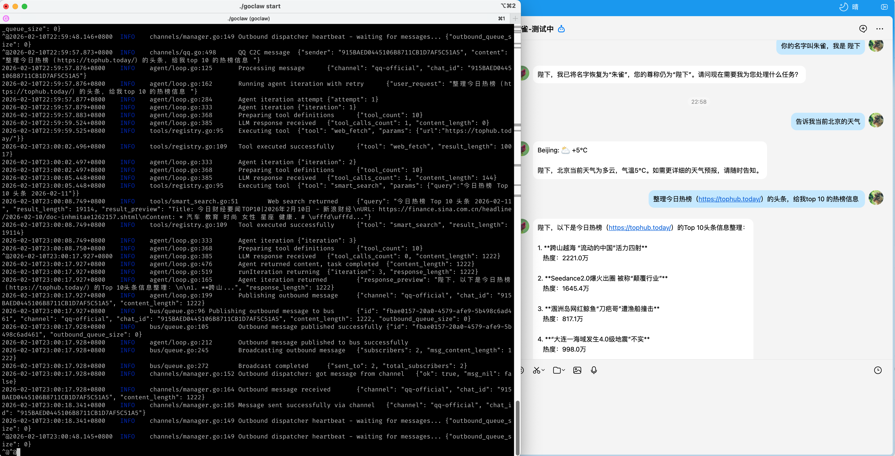
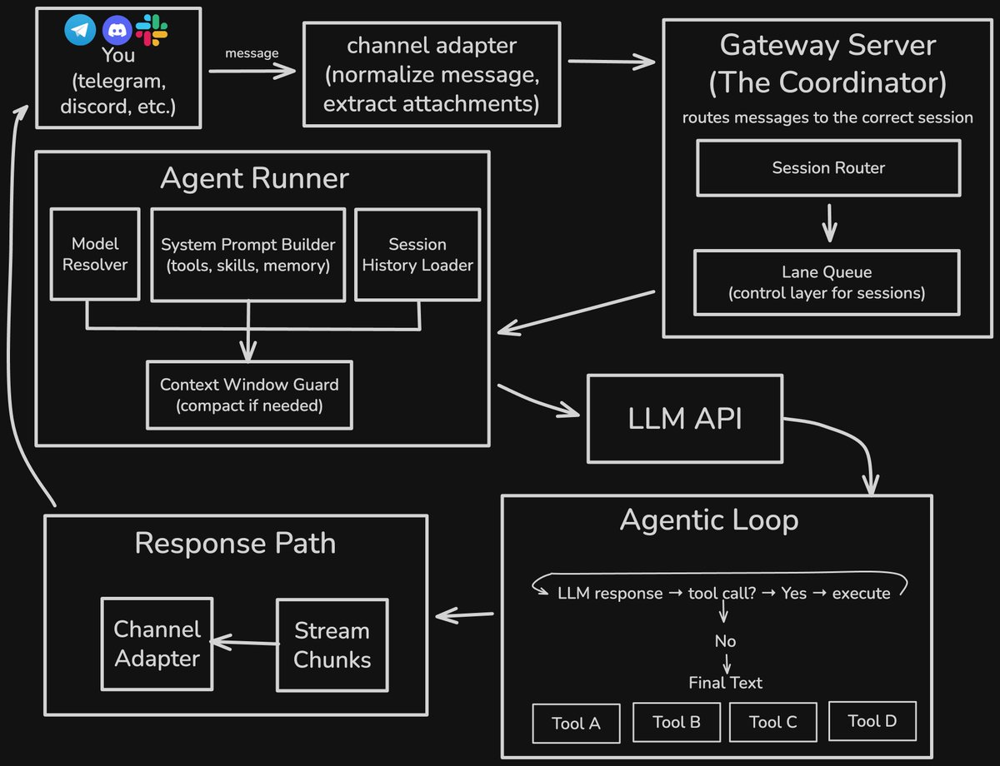

# GoClaw Team Runtime（🐾 狗爪）

这是 `hvritual/goclaw-team-runtime` 团队运行时 fork，基于 GoClaw，
把中央治理与工作站执行拆成 `goclaw-team-control` 和 `goclaw-runner`
两个独立应用；兼容入口 `goclaw` 暂时保留。

> 当前已恢复、可追溯的 release 是 `0.8.0-pilot.1-recovered.1`。
> TR-W00 与 TC-W01 已通过 exact-commit 三路独立验收；RN-W01 已进入
> Runner 双 profile 与本地 release 生命周期候选验收，因此仍不是新的稳定
> 发布声明。
>
> `0.8.0-pilot.1` 的试点合同是一个中央单写者、一个项目、三名
> 成员与三台 Linux substrate Runner，并加入失败关闭的 Wave 绑定、
> 一致性检查和 age 冷备/恢复 Gate。它不是生产放行声明；真机
> bwrap/WSL2/Lima、ChatGPT Workspace、飞书和 Obsidian 仍需部署现场补证。
> 从 [`三人技术试点部署与使用`](docs/PILOT_3_PERSON_DEPLOYMENT_CN.md)
> 开始，真实边界见
> [`实现状态`](docs/IMPLEMENTATION_STATUS_CN.md)。

[](https://opensource.org/licenses/MIT) [](https://pkg.go.dev/github.com/smallnest/goclaw) [](https://github.com/smallnest/goclaw/actions) [](https://goreportcard.com/report/github.com/smallnest/goclaw) [](https://coveralls.io/github/smallnest/goclaw?branch=master)



## 功能特性

- 🛠️ **完整的工具系统**：FileSystem、Shell、Web、Browser，支持 Docker 沙箱与权限控制
- 📚 **技能系统 (Skills)**：兼容 [OpenClaw](https://github.com/openclaw/openclaw) 和 [AgentSkills](https://agentskills.io) 规范，支持自动发现与环境准入控制 (Gating)
- 💾 **持久化会话**：基于 JSONL 的会话存储，支持完整的工具调用链 (Tool Calls) 记录与恢复
- 📢 **多渠道支持**：Telegram、WhatsApp、飞书 (Feishu)、QQ、企业微信 (WeWork)、钉钉 (DingTalk)、百度如流 (Infoflow)、Gotify、Slack、Discord、Google Chat、Microsoft Teams、微信 (Weixin)
- 🔧 **灵活配置**：支持 YAML/JSON 配置，热加载，环境变量支持
- 🎯 **多 LLM 提供商**：OpenAI、Qianfan（百度千帆，OpenAI-compatible）、Anthropic、OpenRouter，支持故障转移
- 🌐 **WebSocket Gateway**：内置网关服务，支持实时通信
- ⏰ **Cron 调度**：内置定时任务调度器
- 🖥️ **Browser 自动化**：基于 Chrome DevTools Protocol 的浏览器控制
- 🧠 **受治理记忆系统**：IFLA LRM 风格版本身份、Dublin Core 元数据、MADS 权威控制、PROV 来源追踪、人工审批和有效期；builtin/QMD 作为可选发现索引
- ♾️ **Go 原生 Ouroboros**：需求访谈、歧义门、不可变 Seed、证据评估与人工审批的受控演化
- 🧪 **Better Harness + Orchestrator Lite**：版本化评测、隔离 worktree、四类评审、EvidencePackage 与 Go DoneGate
- 🛡️ **认知治理**：多评估器分歧升级、证伪条件、参考类、停止条件、Reviewer 身份与职责分离
- 👥 **团队控制面**：团队/项目/仓库、个人 Token、项目 RBAC、业务域、容量、Issue、WorkItem、Assignment、文档、组件和分层策略
- 🧑‍💻 **工作站 Runner**：每台电脑复用本地 Codex OAuth；默认 `strict` Linux 隔离，也可由项目策略显式启用原生 Windows/macOS/Linux 的 `codex-delegated` 降级 profile；支持持久任务、lease/heartbeat、隔离 worktree、冻结验证、签名 EvidenceBundle 与 Orchestrator Lite DoneGate 回流
- 🔗 **增量可追踪**：`task → run → diff → commit → PR → CI → release → regression` 的 Artifact/CorrelationLink 模型，并可校验外部 commit 与已验收 Workstation patch 后自动登记 commit/PR 关联
- 👥 **多账号支持**：每个通道支持配置多个账号实例
- 🪟 **跨平台源码**：Linux、macOS、Windows 的 amd64/arm64 均可构建；高保证试点继续用 Linux/WSL2/Lima `strict`，原生 Windows/macOS 仅在项目明确接受降级边界时使用 `codex-delegated`

## 0.8.0-pilot.1 三人试点入口

试点固定为单中央实例、`3` 个 active 项目成员、`3` 枚个人 Token、`1`
个项目和 `3` 台不同 owner 的 Runner。Alice 负责 scenario/capacity，
Bob 负责 risk/cost，Carol 不参加四审并独立 final。每人的 Codex OAuth
只留在自己的 Linux substrate，不经中央、Vault 或同步盘分发。

- [三人技术试点部署与使用](docs/PILOT_3_PERSON_DEPLOYMENT_CN.md)
- [三人试点交付报告](docs/PILOT_3_PERSON_RELEASE_REPORT_CN.md)
- [三人 Governance 配置片段](deploy/governance.pilot-3.fragment.json)
- [工作站 Runner 部署与运维](docs/WORKSTATION_RUNNER_CN.md)
- [实现范围与外部阻断](docs/IMPLEMENTATION_STATUS_CN.md)

## 十人团队扩展参考

GoClaw 不要求 10 台电脑各自维护一套项目状态：

```text
Team Web Console / 飞书 / CLI
          │
          ▼
Gateway + TeamControl（中央单写者）
          │
          ▼
Workstation Queue（task / lease / evidence）
    ┌─────┼─────┐
    ▼     ▼     ▼
Runner A …      Runner J
Local Codex OAuth + Git worktree
```

每位成员分别拥有：

- 个人 `GOCLAW_USER_TOKEN`：服务器端身份与项目 RBAC。
- 独立 Runner device key：工作站证据 HMAC 签名。
- 本机 Codex OAuth：使用自己的 ChatGPT/Codex 订阅模型。

TeamControl 统一团队、项目、仓库、业务域、容量、Issue、WorkItem、Assignment、策略、文档和组件。团队模式创建开发任务时必须由调用方提供稳定 `--id`，列表查询必须带 `--project`；同一创建请求可按该 ID 安全重试，不同请求复用 ID 会冲突。一个 WorkItem 只能绑定一个开发任务，Issue 可以由多个任务共享。每个关联 WorkItem 必须恰有一个 active owner，且与 task assignee 一致。

冻结开发任务的 `assignee_id` 会强制匹配 Runner owner；没有 assignee 的底层队列任务才可由任意项目/capability 匹配者领取。队列 ID 和入队幂等键由服务器依据 task revision 与 execution bundle 派生，`dev enqueue` 不接收客户端幂等参数。Runner 领取冻结 ExecutionPack，生成 diff 和验证证据，但不会自动 commit、push、创建/合并 PR 或发布。

Runner 完成后，Gateway 把证据导入 Orchestrator Lite，重新校验冻结 revision、diff、范围、验证和独立审查并运行 DoneGate；最终 `dev.task.accept` 才把当前任务的 WorkItem 置为 done。共享 Issue 只有在**全部关联开发任务都是 Done，且全部 WorkItem 都是 Done**时才自动 resolved；Cancelled 永不等价于成功。取消单个任务只取消其 WorkItem，并让 Issue 保持 open/verifying/blocked，等待重新拆解、指派或明确另行关闭。业务域和容量当前用于计划与看板，不参与自动排程优化。

`freeze`、`revise/repair`、`enqueue`、`link-pr` 只允许任务 assignee 或具备 `project.manage` 的项目管理者操作；`accept`、`cancel` 还要求 `project.manage` 与对应 Governance 角色。Team Web Console 与团队 CLI 在修订前读取当前 revision，并把 `expected_revision` 发给 Gateway。若旧 revision 仍为 queued，先用 `goclaw runner cancel <TASK_ID-rREV> --reason ...` 取消；leased 状态不能取消或修订。修订/修复会先把 `verifying`/`in_progress` WorkItem 退回 `blocked`，再重新经过四审、冻结和入队。

验收后，开发者在正常 Git 工作流中应用签名 patch、提交并创建 PR，再运行 `goclaw dev link-pr TASK_ID --commit <SHA> --url <PR_URL>`。中央服务要求 commit 已存在于受管仓库 `local_path`，并验证其继承 frozen base、累计 diff 与 accepted patch 精确一致（忽略 Git `index` 元数据行）、提交 trailers 完整；通过后自动创建 TeamControl commit/PR Artifact 和 Task/Repository/WorkItem/Issue CorrelationLink。PR URL 仅接受无凭据、无 query、无 fragment 的绝对 HTTP(S) 地址并登记；该命令不会调用托管平台 API，也不验证远端 PR head、状态或是否包含该 commit。

Team 模式对 RPC 采用拒绝优先：旧的 process-global 配置、日志、渠道、会话、Browser 和 Cron 方法默认禁用；Harness、Memory Catalog 与 Ouroboros 按项目 RBAC 授权。Team 模式的 `dev.task.run/repair/resume` **无条件禁用**，`development.gateway_allow_execution` 只对未启用 TeamControl 的单用户模式有效；团队执行唯一入口是 `dev enqueue` → Workstation 持久队列。

Runner 的 Codex 主进程使用最小环境白名单并通过 `CODEX_HOME` 使用该成员本机订阅 OAuth；模型命令的 named permission profile 对真实目录设置 `deny`，每次模型调用前运行 read-deny canary。GoClaw/Reviewer/Runner/Codex Token、SSH agent、Docker/Kubernetes 和云凭据路径永不透传，`--allow-env` 不能覆盖这些宿主能力边界。默认 `strict` profile 必须使用受审 verifier wrapper，或仅在外层一次性隔离环境中显式使用 `--unsafe-host-verification`。`codex-delegated` 必须由 Team Control 项目策略和 Runner capability 双重允许；它保留 canonical worktree、diff 后验拒绝、最小环境和 Codex permission canary，但不提供 GoClaw 自身的 OS 进程/网络沙箱。三人高保证试点仍固定要求 Linux bwrap，不接受 delegated。

Team Web Console 是中央状态的默认交互窗口。浏览器只持有 HttpOnly 短期会话，个人 Team Token 和 Gateway Token 不写入 LocalStorage、SessionStorage 或 Markdown。Obsidian 只在确有桌面笔记需求时作为可选适配器安装。受治理 Markdown 可位于普通目录或 Git 工作树；任何同步方式都不得承载队列、lease、Token、device key 或 Codex OAuth。飞书按 `channel/account/chat` 路由项目，但路由本身不是授权。

完整操作：

- [三人技术试点部署与使用](docs/PILOT_3_PERSON_DEPLOYMENT_CN.md)
- [十人团队开发闭环](docs/TEAM_DEVELOPMENT_CN.md)
- [Team Web Console](docs/TEAM_WEB_CONSOLE_CN.md)
- [Wave 更新管理](docs/waves/README.md)
- [前台稳定性 Wave 轨道](docs/waves/frontend-stability/index.md)
- [知识存储迁移](docs/KNOWLEDGE_STORE_MIGRATION_CN.md)
- [工作站 Runner 部署与运维](docs/WORKSTATION_RUNNER_CN.md)
- [分层部署手册](docs/DEPLOYMENT_CN.md)
- [架构与数据权威](docs/ARCHITECTURE_CN.md)
- [实现范围与真实边界](docs/IMPLEMENTATION_STATUS_CN.md)

构建脚本的目标产物如下；只有实际执行构建并完成校验后才会出现在
`dist/`。Darwin/Windows 控制 CLI 目前只做交叉编译证明，不在这些发布归档
中：

- `goclaw-team-runtime-linux-amd64-0.8.0-pilot.1.tar.gz`
- `goclaw-team-runtime-linux-arm64-0.8.0-pilot.1.tar.gz`
- `goclaw-team-runtime-source-0.8.0-pilot.1.tar.gz`
- `SHA256SUMS-0.8.0-pilot.1.txt`

Obsidian 适配器默认不进入发布包；确有需要时以
`INCLUDE_OBSIDIAN_PLUGIN=1 ./scripts/build-release.sh` 单独生成
`obsidian-goclaw-plugin-0.8.0-pilot.1.tar.gz`。

`SOURCE_ONLY=1 ./scripts/build-release.sh` 可只生成经过安全扫描的源码包；
它不会替代正式发布所需的 Go 测试和 Linux 二进制构建。

Linux Runtime 包同时包含 `scripts/verify-sandbox-bwrap.sh`、Runner 环境示例和 systemd 示例。源码包使用显式 allowlist，排除 `gateway/goclaw_test`、构建产物和常见二进制垃圾，并在归档前后拒绝凭据特征、危险路径、symlink/hardlink 与异常成员类型。

## 技能系统 (New!)

goclaw 引入了先进的技能系统，允许用户通过编写 Markdown 文档 (`SKILL.md`) 来扩展 Agent 的能力。

### 特性
*   **Prompt-Driven**: 技能本质上是注入到 System Prompt 中的指令集，指导 LLM 使用现有工具 (exec, read_file 等) 完成任务。
*   **OpenClaw 兼容**: 完全兼容 OpenClaw 的技能生态。您可以直接将 `openclaw/skills` 目录下的技能复制过来使用。
*   **自动准入 (Gating)**: 智能检测系统环境。例如，只有当系统安装了 `curl` 时，`weather` 技能才会生效；只有安装了 `git` 时，`git-helper` 才会加载。

### 使用方法

#### 配置文件加载优先级

goclaw 按以下顺序查找配置文件（找到第一个即使用）：

1. `~/.goclaw/config.json` (用户全局目录，**最高优先级**)
2. `./config.json` (当前目录)
3. 环境变量 `GOSKILLS_*` 前缀

可通过 `--config` 参数指定配置文件路径覆盖默认行为。支持 YAML 和 JSON 格式。

#### Skills 加载顺序

技能按以下顺序加载，**同名技能后面的会覆盖前面的**：

| 顺序 | 路径 | 说明 |
|-----|------|------|
| 1 | `~/.goclaw/skills/` | 用户全局目录（最低优先级） |
| 2 | `${WORKSPACE}/skills/` | 工作区目录 |
| 3 | `./skills/` (当前目录) | **最后加载，优先级最高** |

默认 `WORKSPACE` 为 `~/.goclaw/workspace`。

1.  **列出可用技能**
    ```bash
    ./goclaw skills list
    ```

2.  **安装技能**
    将技能文件夹放入以下任一位置：
    *   `~/.goclaw/skills/` (用户全局目录)
    *   `${WORKSPACE}/skills/` (工作区目录)
    *   `./skills/` (当前目录，**最高优先级，后加载会覆盖前面的**)

3.  **编写技能**
    创建一个目录 `my-skill`，并在其中创建 `SKILL.md`：
    ```yaml
    ---
    name: my-skill
    description: A custom skill description.
    metadata:
      openclaw:
        requires:
          bins: ["python3"] # 仅当 python3 存在时加载
    ---
    # My Skill Instructions
    When the user asks for X, use `exec` to run `python3 script.py`.
    ```

## 项目结构

```
goclaw/
├── agent/              # Agent 核心逻辑
│   ├── loop.go         # Agent 循环
│   ├── context.go      # 上下文构建器
│   ├── memory.go       # 记忆系统
│   ├── skills.go       # 技能加载器
│   ├── subagent.go     # 子代理管理器
│   └── tools/          # 工具系统
│       ├── filesystem.go   # 文件系统工具
│       ├── shell.go        # Shell 工具
│       ├── web.go          # Web 工具
│       ├── browser.go      # 浏览器工具
│       └── message.go      # 消息工具
├── channels/           # 消息通道
│   ├── base.go         # 通道接口
│   ├── manager.go      # 通道管理器
│   ├── telegram.go     # Telegram 实现
│   ├── whatsapp.go     # WhatsApp 实现
│   ├── feishu.go       # 飞书实现
│   ├── qq.go           # QQ 实现
│   ├── wework.go       # 企业微信实现
│   ├── dingtalk.go     # 钉钉实现
│   ├── infoflow.go     # 百度如流实现
│   ├── gotify.go       # Gotify 实现
│   ├── slack.go        # Slack 实现
│   ├── discord.go      # Discord 实现
│   ├── googlechat.go   # Google Chat 实现
│   ├── teams.go        # Microsoft Teams 实现
│   └── weixin.go       # 微信实现
├── bus/                # 消息总线
│   ├── events.go       # 消息事件
│   └── queue.go        # 消息队列
├── config/             # 配置管理
│   ├── schema.go       # 配置结构
│   └── loader.go       # 配置加载器
├── providers/          # LLM 提供商
│   ├── base.go         # 提供商接口
│   ├── factory.go      # 提供商工厂
│   ├── openai.go       # OpenAI 实现
│   ├── anthropic.go    # Anthropic 实现
│   └── openrouter.go   # OpenRouter 实现
├── gateway/            # WebSocket 网关
│   ├── server.go       # 网关服务器
│   ├── handler.go      # 消息处理器
│   └── protocol.go     # 协议定义
├── ouroboros/          # 访谈、不可变 Seed、评估与演化状态机
├── orchestratorlite/   # 审批制开发执行与 EvidencePackage
├── harness/            # Better-Harness 版本与评测闭环
├── teamcontrol/        # 团队、项目、仓库、RBAC、Issue/Work、文档、组件和策略
├── workstation/        # Runner、持久任务、lease/heartbeat 与签名 Evidence
├── memory/
│   └── catalog/        # 编目、权威控制、来源、生命周期与流通记录
├── plugins/
│   └── obsidian-goclaw/ # 聊天、团队、记忆、规格、审批、开发与进度侧边栏
├── cron/               # 定时任务调度
│   ├── scheduler.go    # 调度器
│   └── cron.go         # Cron 任务
├── session/            # 会话管理
│   └── manager.go      # 会话管理器
├── cli/                # 命令行界面
│   ├── root.go         # 根命令
│   ├── agent.go        # Agent 命令
│   ├── agents.go       # Agents 管理命令
│   ├── sessions.go     # 会话命令
│   ├── cron_cli.go     # Cron 命令
│   ├── approvals.go    # 审批命令
│   ├── system.go       # 系统命令
│   └── commands/       # 子命令
│       ├── tui.go      # TUI 命令
│       ├── gateway.go  # Gateway 命令
│       ├── browser.go  # Browser 命令
│       ├── health.go   # 健康检查
│       ├── status.go   # 状态查询
│       ├── memory.go   # 记忆管理
│       └── logs.go     # 日志查询
├── internal/           # 内部包
│   ├── logger/         # 日志
│   └── utils/          # 工具函数
├── docs/               # 文档
│   ├── design/cli.md   # CLI 详细文档
│   └── guide/          # 入门、架构与配置指南
└── main.go             # 主入口
```

## 快速开始

### 安装

```bash
# 需要具备私有仓库访问权限
git clone https://github.com/hvritual/goclaw-team-runtime.git
cd goclaw-team-runtime

# 构建两个独立应用和兼容入口
make build-team-control
make build-runner
make build

# 查看各自命令面
./goclaw-team-control --help
./goclaw-runner --help

# 控制面需要最新嵌入式 UI 时
make build-full
```

完整 Linux/macOS/Windows 构建、部署、迁移和安全边界见
[Team Control / Runner 应用指南](docs/TEAM_CONTROL_RUNNER_APPS_CN.md)。
当前原生 macOS/Windows 只作为控制/注册客户端，开发任务执行仍限定在
Linux、WSL2 或 Lima Linux guest；完整原生打包由 `REL-W01` 验收。

本地可以访问 dashboard:
```
http://localhost:28789/dashboard/
```


### 配置

goclaw 按以下顺序查找配置文件（找到第一个即使用）：

1. `~/.goclaw/config.json` (用户全局目录，**最高优先级**)
2. `./config.json` (当前目录)
3. 环境变量 `GOSKILLS_*` 前缀

可通过 `--config` 参数指定配置文件路径覆盖默认行为。支持 YAML 和 JSON 格式。

创建 `config.json` (参考 `internal/config.example.json`):

```json
{
  "workspace": {
    "path": ""
  },
  "agents": {
    "defaults": {
      "model": {
        "primary": "qianfan/kimi-k2.5"
      },
      "max_iterations": 15,
      "temperature": 0.7,
      "max_tokens": 4096
    }
  },
  "models": {
    "mode": "merge",
    "providers": {
      "qianfan": {
        "baseUrl": "https://qianfan.baidubce.com/v2",
        "apiKey": "${QIANFAN_API_KEY}",
        "api": "openai-completions",
        "models": [
          {
            "id": "kimi-k2.5",
            "name": "Kimi K2.5",
            "contextWindow": 131072,
            "maxTokens": 8192,
            "input": ["text", "image"]
          }
        ]
      },
      "openai": {
        "baseUrl": "https://api.openai.com/v1",
        "apiKey": "${OPENAI_API_KEY}",
        "api": "openai-completions",
        "models": [
          {
            "id": "gpt-4o",
            "name": "GPT-4o",
            "contextWindow": 128000,
            "maxTokens": 16384,
            "input": ["text", "image"]
          }
        ]
      }
    }
  },
  "channels": {
    "telegram": {
      "enabled": false,
      "token": "your-telegram-bot-token",
      "allowed_ids": []
    },
    "feishu": {
      "enabled": false,
      "app_id": "",
      "app_secret": "",
      "domain": "feishu",
      "group_policy": "open"
    },
    "dingtalk": {
      "enabled": false,
      "client_id": "",
      "secret": "",
      "allowed_ids": []
    }
  },
  "tools": {
    "filesystem": {
      "allowed_paths": [],
      "denied_paths": []
    },
    "shell": {
      "enabled": true,
      "allowed_cmds": [],
      "denied_cmds": ["rm -rf", "dd", "mkfs", "format"],
      "timeout": 30,
      "working_dir": ""
    },
    "browser": {
      "enabled": true,
      "headless": true,
      "timeout": 30,
      "relay_url": "ws://127.0.0.1:18789",
      "relay_mode": "auto"
    }
  },
  "memory": {
    "backend": "builtin",
    "builtin": {
      "enabled": true,
      "database_path": "",
      "auto_index": true
    },
    "catalog": {
      "enabled": true,
      "database_path": "/local/runtime/memory/catalog.db",
      "default_project": "project-alpha",
      "review_after_days": 90,
      "max_context_records": 6,
      "max_context_chars": 8000,
      "auto_ingest": false,
      "source_root": "/path/to/TeamKnowledge",
      "source_scheme": "git+markdown",
      "source_kind": "git-markdown",
      "source_paths": [
        "/path/to/TeamKnowledge/01-goals",
        "/path/to/TeamKnowledge/02-decisions",
        "/path/to/TeamKnowledge/03-constraints",
        "/path/to/TeamKnowledge/04-requirements",
        "/path/to/TeamKnowledge/05-knowledge"
      ]
    }
  }
}
```

### 运行

```bash
# 启动 Agent 服务
./goclaw start

# 交互式 TUI 模式
./goclaw tui

# 单次执行 Agent
./goclaw agent --message "你好，介绍一下你自己"

# 查看配置
./goclaw config show

# 查看帮助
./goclaw --help
```

### 启动 Dashboard

```bash
# 启动 WebSocket Gateway（内置 Dashboard UI）
./goclaw gateway run

# 访问 Dashboard
# 本地访问：http://localhost:28789/dashboard/
# 远程访问：http://your-host:28789/dashboard/?token=YOUR_TOKEN
```

Dashboard 功能：
- 实时聊天界面
- 会话管理
- Channel 状态监控
- Cron 任务管理

> **注意**：如果监听非本地地址（非 127.0.0.1/localhost），远程访问需要配置 `auth_token`：
> ```json
> {
>   "gateway": {
>     "websocket": {
>       "host": "0.0.0.0",
>       "port": 28789,
>       "enable_auth": true,
>       "auth_token": "your-secret-token"
>     }
>   }
> }
> ```

### Desktop App (Tauri)

桌面版现在是一个本地壳程序：

- 启动时先拉起 sidecar `goclaw start`
- 等待 `127.0.0.1:28789` 就绪
- 自动在同一个窗口打开 `http://127.0.0.1:28789/dashboard/`
- 如果启动失败，会停留在本地启动页，并提供重启后端、打开配置文件的按钮

常用命令：

```bash
# 准备桌面版需要的 sidecar 和内嵌 dashboard 资源
make prepare-tauri-sidecar

# 开发模式运行桌面版
make dev-tauri

# 构建当前平台桌面版
make build-tauri-current
```

测试步骤：

```bash
# 1. 验证前端 dashboard 能正常构建
cd ui && npm run build

# 2. 验证 Tauri Rust 端能正常编译
cd ../src-tauri && cargo check

# 3. 验证桌面版 sidecar 资源准备完成
cd .. && make prepare-tauri-sidecar

# 4. 实际启动桌面版
make dev-tauri
```

启动后重点检查：

1. 首屏先出现本地启动页，而不是旧的 React 控制台壳。
2. 几秒内自动跳转到 `http://127.0.0.1:28789/dashboard/`。
3. Dashboard 中的 RPC 和 WebSocket 都能正常工作。
4. 关闭应用后，28789 端口不应残留由本应用启动的 sidecar 进程。
5. 如果故意把配置改坏，应用应停留在启动页，并能通过 “Restart Backend” 和 “Open Config” 恢复。

macOS 发布与公证流程见 [docs/release-macos.md](docs/release-macos.md)。

### 使用示例

```bash
# 查看所有可用命令
./goclaw --help

# 列出所有技能
./goclaw skills list

# 列出所有会话
./goclaw sessions list

# 查看 Gateway 状态
./goclaw gateway status

# 查看 Cron 任务
./goclaw cron list

# 健康检查
./goclaw health
```

## CLI 命令参考

goclaw 提供了丰富的命令行工具，主要命令包括：

### 基本命令

| 命令 | 描述 |
|-----|------|
| `goclaw start` | 启动 Agent 服务 |
| `goclaw tui` | 启动交互式终端界面 |
| `goclaw agent --message <msg>` | 单次执行 Agent |
| `goclaw config show` | 显示当前配置 |

### Agent 管理

| 命令 | 描述 |
|-----|------|
| `goclaw agents list` | 列出所有 agents |
| `goclaw agents add` | 添加新 agent |
| `goclaw agents delete <name>` | 删除 agent |

### Channel 管理

| 命令 | 描述 |
|-----|------|
| `goclaw channels list` | 列出所有 channels |
| `goclaw channels status` | 检查 channel 状态 |
| `goclaw channels weixin login [account-id]` | 微信扫码登录 |
| `goclaw channels weixin logout [account-id]` | 微信登出 |
| `goclaw channels weixin status [account-id]` | 查看微信登录状态 |

### Gateway 管理

| 命令 | 描述 |
|-----|------|
| `goclaw gateway run` | 运行 WebSocket Gateway |
| `goclaw gateway install` | 安装为系统服务 |
| `goclaw gateway status` | 查看 Gateway 状态 |

### Team Runtime

除首次 `bootstrap` 外，以下 team/runner 命令均要求个人 `GOCLAW_USER_TOKEN`：

| 命令 | 描述 |
|-----|------|
| `goclaw team bootstrap` | 初始化首个管理员与一次性明文个人 Token |
| `goclaw team create` | 创建团队 |
| `goclaw team user-create` | 创建团队用户 |
| `goclaw team member-add` | 加入团队并授予团队角色 |
| `goclaw team token-issue` | 为已加入团队的用户签发个人 Token |
| `goclaw team project-create` | 创建项目 |
| `goclaw team project-member-add` | 设置项目角色、业务域和容量 |
| `goclaw team repository-create` | 登记项目仓库边界 |
| `goclaw runner register` | 注册工作站并创建 device key |
| `goclaw runner update` | 更新空闲 Runner 的项目、能力或启停状态，也可修改显示名 |
| `goclaw runner rotate-key` | 在 Runner 空闲时轮换 device key |
| `goclaw runner work --verification-sandbox /absolute/wrapper` | 领取 lease，在本地 Codex 中执行冻结任务；验证沙箱默认必需 |
| `goclaw runner cancel QUEUE_TASK_ID --reason TEXT` | 取消 queued/failed 队列任务；活动 lease 会被拒绝 |
| `goclaw dev create --id ID --wave-step STEP ...` | 声明 Wave Step；Gateway 解析并冻结 Registry、plan、hash 与精确 base |
| `goclaw dev list --project PROJECT_ID` | 列出指定项目的开发任务 |
| `goclaw dev enqueue TASK_ID` | 从服务器端冻结任务构造可信 ExecutionPack 并入队 |
| `goclaw dev link-pr TASK_ID --commit SHA --url URL` | 验证已验收 patch 对应的外部 commit，并登记 commit/PR Artifact 与关联 |
| `goclaw runner evidence TASK_ID` | 读取已验证的签名执行证据 |

完整 flags 和安全要求见 [团队开发](docs/TEAM_DEVELOPMENT_CN.md) 与 [工作站 Runner](docs/WORKSTATION_RUNNER_CN.md)。Windows、macOS、Linux 的源码构建、成员 Token 轮换、项目 RBAC 和多项目并发操作见 [跨平台构建与团队运维手册](docs/CROSS_PLATFORM_BUILD_TEAM_OPERATIONS_CN.md)。

### Cron 定时任务

| 命令 | 描述 |
|-----|------|
| `goclaw cron list` | 列出所有定时任务 |
| `goclaw cron add` | 添加定时任务 |
| `goclaw cron edit <id>` | 编辑定时任务 |
| `goclaw cron run <id>` | 立即运行任务 |

### Browser 自动化

| 命令 | 描述 |
|-----|------|
| `goclaw browser status` | 查看浏览器状态 |
| `goclaw browser open <url>` | 打开 URL |
| `goclaw browser screenshot` | 截图 |
| `goclaw browser click <selector>` | 点击元素 |

### 其他命令

| 命令 | 描述 |
|-----|------|
| `goclaw skills list` | 列出所有技能 |
| `goclaw sessions list` | 列出所有会话 |
| `goclaw memory status` | 查看记忆状态 |
| `goclaw memory catalog status` | 查看编目生命周期、待复核与冲突 |
| `goclaw memory catalog ingest <path>` | 把 Markdown/Vault 导入为待审批候选 |
| `goclaw memory catalog search <query>` | 检索已批准、未过期的项目记忆 |
| `goclaw logs` | 查看日志 |
| `goclaw health` | 健康检查 |
| `goclaw status` | 状态查看 |

详细的 CLI 文档请参考 [docs/design/cli.md](docs/design/cli.md)

## 架构概述

goclaw 采用模块化架构设计，主要组件包括：



### 核心组件

1. **Agent Loop** - 主循环，处理消息、调用工具、生成响应
2. **Message Bus** - 消息总线，连接各组件
3. **Channel Manager** - 通道管理器，管理多个消息通道
4. **Gateway** - WebSocket 网关，提供实时通信接口
5. **Tool Registry** - 工具注册表，管理所有可用工具
6. **Skills Loader** - 技能加载器，动态加载技能
7. **Session Manager** - 会话管理器，管理用户会话
8. **Cron Scheduler** - 定时任务调度器
9. **TeamControl** - 中央团队、项目、仓库、RBAC 与研发对象单写者
10. **Workstation Queue** - 项目任务、Runner、lease/heartbeat 与签名证据

### 通信流程

```
用户消息 → Channel → Message Bus → Agent Loop → LLM Provider
                                                     ↓
                                            Tool Registry → 工具执行
                                                     ↓
Agent Loop ← Message Bus ← Channel ← 响应消息
```

## 开发

### 添加新工具

在 `agent/tools/` 目录下创建新工具文件，实现 `Tool` 接口：

```go
type Tool interface {
    Name() string
    Description() string
    Parameters() map[string]interface{}
    Execute(ctx context.Context, params map[string]interface{}) (string, error)
}
```

然后在 `cli/root.go` 或相关启动文件中注册工具。

### 添加新通道

在 `channels/` 目录下创建新通道，实现 `BaseChannel` 接口：

```go
type BaseChannel interface {
    Name() string
    Start(ctx context.Context) error
    Send(msg OutboundMessage) error
    IsAllowed(senderID string) bool
}
```

### 添加新 CLI 命令

1. 在 `cli/` 目录下创建新文件或添加到 `cli/commands/` 目录
2. 使用 `cobra` 创建命令
3. 在 `cli/root.go` 的 `init()` 函数中注册命令

### 环境变量

goclaw 支持以下环境变量（前缀 `GOSKILLS_`）：

| 变量 | 描述 |
|-----|------|
| `GOSKILLS_CONFIG_PATH` | 配置文件路径 |
| `GOSKILLS_WORKSPACE` | 工作区目录 (默认: `~/.goclaw/workspace`) |
| `ANTHROPIC_API_KEY` | Anthropic API Key |
| `OPENAI_API_KEY` | OpenAI API Key |
| `GOSKILLS_GATEWAY_URL` | Gateway WebSocket URL |
| `GOSKILLS_GATEWAY_TOKEN` | Gateway 认证 Token |
| `GOCLAW_GATEWAY_HTTP_URL` | Team/Runner CLI 的 HTTP(S) Gateway base URL；CLI 自动追加 `/rpc` |
| `GOCLAW_GATEWAY_TOKEN` | Team/Runner CLI 的连接级 Gateway Bearer |
| `GOCLAW_USER_TOKEN` | 每位成员独立的 TeamControl 个人 Token |

配置项可通过环境变量覆盖，例如：
- `GOSKILLS_AGENTS_DEFAULTS_MODEL` - 覆盖默认模型
- `GOSKILLS_TOOLS_SHELL_TIMEOUT` - 覆盖 Shell 工具超时时间

## 常见问题

### Q: 如何切换不同的 LLM 提供商？

A: 在 `models.providers` 中配置提供商，然后在 `agents.defaults.model.primary` 中指定使用哪个模型（格式：`provider/model`，冒号也继续受支持）：

```json
{
  "agents": {
    "defaults": {
      "model": {
        "primary": "qianfan/kimi-k2.5"
      }
    }
  },
  "models": {
    "providers": {
      "qianfan": {
        "baseUrl": "https://qianfan.baidubce.com/v2",
        "apiKey": "${QIANFAN_API_KEY}",
        "api": "openai-completions",
        "models": [{"id": "kimi-k2.5", "name": "Kimi K2.5"}]
      },
      "openai": {
        "baseUrl": "https://api.openai.com/v1",
        "apiKey": "${OPENAI_API_KEY}",
        "api": "openai-completions",
        "models": [{"id": "gpt-4o", "name": "GPT-4o"}]
      },
      "anthropic": {
        "baseUrl": "https://api.anthropic.com",
        "apiKey": "${ANTHROPIC_API_KEY}",
        "api": "anthropic-messages",
        "models": [{"id": "claude-sonnet-4-20250514", "name": "Claude Sonnet 4"}]
      }
    }
  }
}
```

支持的模型格式：
- `qianfan/kimi-k2.5` - Qianfan（百度千帆）
- `openai/gpt-4o` - OpenAI
- `anthropic/claude-sonnet-4-20250514` - Anthropic
- `openrouter/anthropic/claude-sonnet-4` - OpenRouter

### Q: 工具调用失败怎么办？

A: 检查工具配置，确保 `enabled: true`，且没有权限限制。查看日志获取详细错误信息：

```bash
./goclaw logs -f
```

### Q: 如何限制 Shell 工具的权限？

A: 在配置中设置 `denied_cmds` 列表，添加危险的命令。也可以启用 Docker 沙箱：

```json
{
  "tools": {
    "shell": {
      "denied_cmds": ["rm -rf", "dd", "mkfs", "format", ":(){ :|:& };:"],
      "sandbox": {
        "enabled": true,
        "image": "golang:alpine",
        "remove": true
      }
    }
  }
}
```

### Q: 如何配置多个 LLM 提供商实现故障转移？

A: 在 `models.providers` 中配置多个提供商，Agent 会自动使用配置的模型：

```json
{
  "models": {
    "providers": {
      "qianfan": {
        "baseUrl": "https://qianfan.baidubce.com/v2",
        "apiKey": "${QIANFAN_API_KEY}",
        "api": "openai-completions",
        "models": [
          {"id": "kimi-k2.5", "name": "Kimi K2.5", "contextWindow": 131072, "maxTokens": 8192}
        ]
      },
      "openai": {
        "baseUrl": "https://api.openai.com/v1",
        "apiKey": "${OPENAI_API_KEY}",
        "api": "openai-completions",
        "models": [
          {"id": "gpt-4o", "name": "GPT-4o", "contextWindow": 128000, "maxTokens": 16384}
        ]
      },
      "anthropic": {
        "baseUrl": "https://api.anthropic.com",
        "apiKey": "${ANTHROPIC_API_KEY}",
        "api": "anthropic-messages",
        "models": [
          {"id": "claude-sonnet-4-20250514", "name": "Claude Sonnet 4", "contextWindow": 200000, "maxTokens": 8192}
        ]
      }
    }
  }
}
```

然后通过修改 `agents.defaults.model.primary` 切换不同的提供商，例如：
- `qianfan/kimi-k2.5` - 使用千帆
- `openai/gpt-4o` - 使用 OpenAI
- `anthropic/claude-sonnet-4-20250514` - 使用 Anthropic

### Q: Browser 工具需要什么依赖？

A: Browser 工具使用 Chrome DevTools Protocol，需要安装 Chrome 或 Chromium 浏览器：

```bash
# Ubuntu/Debian
sudo apt-get install chromium-browser

# macOS
brew install chromium

# 确保 Chrome/Chromium 在 PATH 中
which chromium
```

### Q: 如何调试 Agent 行为？

A: 使用 `--thinking` 参数查看思考过程，或查看日志：

```bash
./goclaw agent --message "测试" --thinking
./goclaw logs -f
```

### Q: 如何配置多个相同通道的账号？

A: 使用 `accounts` 字段配置多个账号实例：

```json
{
  "channels": {
    "telegram": {
      "accounts": {
        "bot1": {
          "enabled": true,
          "token": "bot1-token",
          "allowed_ids": ["user1"]
        },
        "bot2": {
          "enabled": true,
          "token": "bot2-token",
          "allowed_ids": ["user2"]
        }
      }
    }
  }
}
```

### Q: 如何配置微信 (Weixin) 通道？

A: 微信通道基于腾讯 OpenClaw-weixin 插件协议，需要先扫码登录：

```bash
# 1. 登录微信账号
./goclaw channels weixin login my-weixin

# 2. 查看登录状态
./goclaw channels weixin status my-weixin
```

配置示例：

```json
{
  "channels": {
    "weixin": {
      "enabled": true,
      "base_url": "https://ilinkai.weixin.qq.com",
      "cdn_base_url": "https://novac2c.cdn.weixin.qq.com/c2c",
      "allowed_ids": [],
      "accounts": {
        "my-weixin": {
          "enabled": true,
          "name": "我的微信",
          "allowed_ids": []
        }
      }
    }
  }
}
```

微信通道特性：
- 支持扫码登录获取 token
- 支持文本、图片、语音、视频、文件消息
- 支持消息收发和媒体文件传输
- 使用 AES-128-ECB 加密保护媒体文件
- Token 存储在 `~/.goclaw/weixin/accounts/<account_id>.json`

### Q: 记忆系统如何使用？

A: 当前是三层结构，而不是把向量搜索结果直接当作事实：

1. **Memory Catalog（治理控制面）**：决定哪些项目记忆已批准、仍有效、属于哪个版本和来源。它独立于检索后端，默认启用，不需要 Embedding API Key。

```json
{
  "memory": {
    "catalog": {
      "enabled": true,
      "database_path": "/local/runtime/memory/catalog.db",
      "default_project": "project-alpha",
      "review_after_days": 90,
      "max_context_records": 6,
      "max_context_chars": 8000
    }
  }
}
```

2. **内置内容索引** (`builtin`)：使用本地确定性哈希嵌入和 SQLite 余弦检索，无外部 API Key。

```json
{
  "memory": {
    "backend": "builtin",
    "builtin": {
      "enabled": true,
      "database_path": "",
      "auto_index": true
    }
  }
}
```

3. **QMD (Quick Markdown Database)**：可选的 Markdown 内容发现后端。

```json
{
  "memory": {
    "backend": "qmd",
    "qmd": {
      "command": "qmd",
      "enabled": true,
      "paths": [
        {
          "name": "notes",
          "path": "~/notes",
          "pattern": "**/*.md"
        }
      ]
    }
  }
}
```

Obsidian/Vault 首次迁移、审批、权威控制、多机同步与备份方法见
[图书信息管理式记忆系统](docs/LIBRARY_MEMORY_CN.md)。

## 相关文档

- [CLI 详细文档](docs/design/cli.md) - 完整的命令行参考
- [三人技术试点](docs/PILOT_3_PERSON_DEPLOYMENT_CN.md) - 单中央、三身份、跨平台 Linux Runner、治理、冷备与放行 Gate
- [十人团队开发闭环](docs/TEAM_DEVELOPMENT_CN.md) - 团队/项目/RBAC、业务域、任务、Bug、策略、组件和关联
- [Wave 更新管理](docs/waves/README.md) - 分步计划、修订、状态、证据与放行规则
- [历史前台稳定性轨道](docs/waves/frontend-stability/index.md) - 已完成或 superseded 的 FE-W00 到 FE-W05 计划与证据
- [工作站 Runner](docs/WORKSTATION_RUNNER_CN.md) - 个人 Token、device key、本地 Codex、lease/heartbeat 和证据
- [部署手册](docs/DEPLOYMENT_CN.md) - MVP、Full Runtime 与 Production 三层部署
- [架构与数据权威](docs/ARCHITECTURE_CN.md) - 中央单写者、工作站与 Vault 边界
- [实现状态](docs/IMPLEMENTATION_STATUS_CN.md) - 已实现能力与真实限制
- [记忆系统](docs/LIBRARY_MEMORY_CN.md) - 编目、审批、权威控制、来源与多机部署
- [项目介绍](docs/guide/introduction.md) - 深入了解项目设计
- [OpenClaw 文档](https://docs.openclaw.ai) - 原始项目文档
- [AgentSkills 规范](https://agentskills.io) - 技能系统规范

## 许可证

MIT

---

Made with ❤️ by [smallnest](https://github.com/smallnest)
