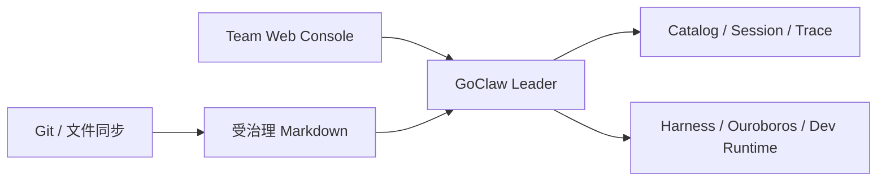

# 图书信息管理式记忆系统

本实现把“记忆”从一组相似文本升级为可编目、可追溯、可评审、可失效的项目馆藏。它不是让模型把每次对话都永久记住，而是把信息分成三层：

1. **受治理 Markdown：馆藏原件与人类编辑面。** 可使用普通目录或 Git 工作树；Obsidian 只是可选编辑器。
2. **Memory Catalog：受治理的目录与流通控制面。** SQLite 只运行在 GoClaw Leader 本机。
3. **Builtin/QMD：内容发现索引。** 用于召回候选内容，不决定某条信息是否可信或仍然有效。

只有 Catalog 中处于 `active`、位于当前项目或共享项目 `*`、并且仍在有效期内的记录，才可能自动进入模型上下文。Agent、飞书和自动导入只能创建 `pending` 候选，不能自行提升为长期记忆。

## 1. 方法论映射

实现参考以下公开模型，但采用适合本地项目记忆的轻量关系模型，不要求 RDF 或专用图数据库：

| 图书信息管理概念 | GoClaw 字段/机制 | 解决的问题 |
|---|---|---|
| IFLA LRM Work | `work_id` | 同一概念的长期身份 |
| Expression | `expression_id`、`language` | 同一概念的语言或表达形式 |
| Manifestation | `manifestation_id`、`version`、`checksum` | 一次具体内容版本 |
| Item | `item_id`、`provenance.source_uri` | 知识目录中的一份具体来源 |
| Dublin Core | `title`、`abstract`、`subjects`、`language`、`collection` | 一致的描述元数据 |
| MADS 权威控制 | preferred label、aliases、redirect | 人名、系统名、项目名的同义与改名 |
| PROV | source、agent、activity、trace、captured time、SHA-256 | 结论从哪里来、由谁产生、能否复核 |
| 馆藏生命周期 | pending/active/rejected/superseded/withdrawn | 防止草稿、旧版和撤回内容混入事实 |
| 流通记录 | retrieved/cited/accepted/rejected events | 记录记忆被怎样使用，而不是只记录它存在 |

方法论来源：

- [IFLA Library Reference Model](https://repository.ifla.org/items/214c74cb-c075-4428-a138-39f8d06c55aa)
- [DCMI Metadata Terms](https://www.dublincore.org/specifications/dublin-core/dcmi-terms/)
- [Library of Congress MADS](https://www.loc.gov/standards/mads/)
- [W3C PROV-O](https://www.w3.org/TR/prov-o/)

## 2. 记录模型与生命周期

支持的记录类型：

- `goal`
- `decision`
- `constraint`
- `requirement`
- `fact`
- `preference`
- `procedure`
- `lesson`
- `context`
- `conversation`
- `source`

主生命周期：

```text
Vault / Agent / Gateway
          │
          ▼
       pending ───────► rejected
          │ 人工审批
          ▼
        active ───────► withdrawn
          │ 新版本获批
          ▼
     superseded
```

`quarantined` 已保留在模式中，用于后续隔离安全或完整性异常；当前版本不会自动把记录转入该状态。

关键规则：

- 新记录永远先进入 `pending`。
- 同一个稳定 `source_uri` 的内容没有变化时，重复导入是幂等的。
- 同一来源内容变化时，沿用 Work/Expression 身份并生成新 Manifestation 与递增版本。
- 新版本获批时，被替代的 active/pending 版本变为 `superseded`。
- 默认检索只返回 `active`。
- `valid_from` 尚未到达，或 `valid_until` / `expires_at` 已过期的记录不会自动进入上下文。
- `context` 的默认复核期最长 14 天，`conversation` 最长 30 天，其他类型默认 90 天，可由配置缩短。
- `review_at` 到期不会直接删除记录，但 UI 和检索会给出警告；审批人应续期、替代或撤回。
- `contradicts` 关系会保留冲突双方并进入统计，不以“最后写入”偷偷覆盖争议。
- `supersedes` 和 `contradicts` 不能跨项目；项目可只读引用共享项目 `*` 的非覆盖关系。

## 3. 受治理 Markdown 编目格式

推荐知识目录结构：

```text
KnowledgeRoot/
├── 01-goals/
├── 02-decisions/
├── 03-constraints/
├── 04-requirements/
└── 05-knowledge/
```

路径会提供默认类型；Frontmatter 可以精确描述：

```yaml
---
title: Catalog SQLite 不进入知识目录同步
description: 多机共享 Markdown，单 Leader 持有运行时目录与审批状态
type: decision
subject:
  - GoClaw
  - Markdown
  - memory
language: zh-CN
goclaw:
  work_id: work-memory-runtime-boundary
  expression_id: expr-memory-runtime-boundary-zh
  authorities:
    - auth-goclaw-runtime
  facets:
    lifecycle:
      - active
    confidentiality:
      - internal
    time_horizon:
      - long_term
    source_reliability:
      - verified
    scope:
      - project
  confidence: 0.95
  valid_from: 2026-07-24
  review_at: 2026-10-22
  trace_id: trace-architecture-review
  evidence_refs:
    - ADR-0007
---

# 决策

知识目录只同步 Markdown。`catalog.db`、WAL、会话、Trace、Harness、Ouroboros
和 Development Runtime 均保留在 GoClaw Leader 的本机目录。
```

注意：

- Frontmatter 中即使写入 `status: active`，导入结果仍然是 `pending`。
- `source_root` 决定稳定的相对路径身份。默认会形成
  `markdown://project-alpha/02-decisions/example.md`；Git 工作树可显式使用
  `git+markdown://` 并记录 commit revision。
- 多个 `source_paths` 必须共享同一 `source_root`，否则两个目录里的同名文件可能失去稳定区分；配置校验会拒绝这种自动导入设置。
- 导入器拒绝符号链接、跳过 `.git`、`.obsidian`、`node_modules` 等目录，并限制单文件为 2 MiB。
- Frontmatter 是描述数据，不是模型指令。自动上下文会明确把正文标记为“引用证据”，并对长度进行限制。

## 4. 配置

```json
{
  "memory": {
    "backend": "builtin",
    "builtin": {
      "enabled": true,
      "database_path": "/srv/goclaw/runtime/memory/store.db",
      "auto_index": true
    },
    "catalog": {
      "enabled": true,
      "database_path": "/srv/goclaw/runtime/memory/catalog.db",
      "default_project": "project-alpha",
      "review_after_days": 90,
      "max_context_records": 6,
      "max_context_chars": 8000,
      "auto_ingest": false,
      "source_root": "/srv/goclaw/knowledge",
      "source_scheme": "git+markdown",
      "source_kind": "git-markdown",
      "source_paths": [
        "/srv/goclaw/knowledge/01-goals",
        "/srv/goclaw/knowledge/02-decisions",
        "/srv/goclaw/knowledge/03-constraints",
        "/srv/goclaw/knowledge/04-requirements",
        "/srv/goclaw/knowledge/05-knowledge"
      ]
    }
  }
}
```

建议先保持 `auto_ingest=false`，手动完成首次迁移和抽样核对；确认目录、类型和项目边界后再启用。自动导入也只生成候选，不会自动批准。

Catalog 与 `memory.backend` 相互独立：

- Catalog 是“哪些信息获准作为项目记忆”的控制面。
- `builtin` 使用本地确定性哈希嵌入与 SQLite 余弦检索，不需要外部 Embedding API Key。
- `qmd` 可用于 Markdown 内容发现，失败时可回退到 builtin。
- 当前 Catalog 自身使用带字段权重、权威别名和 Facet 的本地词法检索；它不会把相似度当作真实性。

## 5. 首次迁移与日常操作

查看状态：

```bash
goclaw memory catalog status --project project-alpha
```

扫描整个知识目录。`--source-root` 必须指向稳定根；Git 工作树使用
`git+markdown` 让来源同时携带 commit revision：

```bash
goclaw memory catalog ingest /srv/goclaw/knowledge \
  --source-root /srv/goclaw/knowledge \
  --source-scheme git+markdown \
  --project project-alpha \
  --actor migration-2026-07
```

检查候选：

```bash
goclaw memory catalog list \
  --project project-alpha \
  --status pending
```

审批需要在配置中注册审批人，并为其赋予 `memory_approve` 角色：

```bash
export GOCLAW_REVIEWER_TOKEN='审批人的原始 Token'

goclaw memory catalog approve mem-... \
  --reviewer memory-curator \
  --rationale "与 ADR-0007、当前部署配置及负责人确认结果一致" \
  --counterargument "若未来改为多 Leader，共享边界需要重新评审" \
  --evidence-ref ADR-0007
```

其他生命周期操作：

```bash
goclaw memory catalog reject mem-... --reviewer memory-curator \
  --rationale "来源无法复核" \
  --counterargument "原作者可能持有尚未归档的证据"

goclaw memory catalog renew mem-... --days 90 \
  --reviewer memory-curator \
  --rationale "复核后仍有效" \
  --counterargument "下一次基础设施迁移可能使其失效"

goclaw memory catalog withdraw mem-... \
  --reviewer memory-curator \
  --rationale "该约束已被正式撤销" \
  --counterargument "历史任务仍可能需要引用旧约束"
```

检索：

```bash
goclaw memory catalog search "运行时数据库是否同步" \
  --project project-alpha \
  --kind decision,constraint \
  --limit 10
```

## 6. 权威控制

权威记录解决同一实体的别名、改名、缩写和中英文名称问题。支持
`person`、`organization`、`project`、`system`、`topic`、`place`、`device`。

权威写入需要 `authority_manage` 角色：

```bash
goclaw memory catalog authority upsert "GoClaw Runtime" \
  --project project-alpha \
  --type system \
  --alias GoClaw \
  --alias 狗爪运行时 \
  --reviewer authority-curator \
  --rationale "项目术语表确认该名称为首选名称" \
  --counterargument "上游仓库仍使用较短名称"
```

解析别名：

```bash
goclaw memory catalog authority resolve "狗爪运行时" \
  --project project-alpha
```

合并重复权威项：

```bash
goclaw memory catalog authority merge auth-duplicate auth-canonical \
  --reviewer authority-curator \
  --rationale "两项指向同一运行时" \
  --counterargument "旧名称可能代表历史分支"
```

合并会把旧项重定向到规范项，并更新 Catalog 中的引用；历史记录和审批决定仍保留。

## 7. Agent、Gateway 与 Team Web Console

Agent 获得两个受限工具：

- `search_project_memory`：只查当前运行项目及共享项目的已批准、未过期记录。
- `propose_project_memory`：只创建候选，可显式声明替代、矛盾、证据和失效时间。

Agent 工具中的 `project_id` 不能覆盖渠道路由已绑定的项目。飞书、Team Web Console
和可选 Obsidian 适配器只要解析到相同 `project_id + topic_id`，会话仍按项目共享；
Catalog 则按 `project_id` 提供跨会话的长期记忆。

Gateway 提供 `memory.catalog.*` 和 `memory.authority.*` JSON-RPC。审批、拒绝、撤回、续期和权威变更必须通过 Reviewer 身份与角色校验。

Team Web Console 的“记忆/审批”页提供：

- active、pending、待复核、冲突等统计；
- 已批准记忆检索与来源/校验和展示；
- pending 候选批准或拒绝；
- 到期记录续期或撤回；
- 与聊天、规格、开发和 Trace 看板使用同一个项目选择器。

## 8. 多机、备份与恢复

推荐拓扑：



运行约束：

- 同一项目只运行一个负责 Catalog 自动导入和审批写入的 Leader。
- 不要通过任何文件同步或 Git 同步 `catalog.db`、`catalog.db-wal`、`catalog.db-shm`。
- 多台电脑的知识目录绝对路径可以不同；稳定身份来自相对 `source_root` 的路径和可选 Git revision。
- Leader 迁移时，应迁移 Catalog 备份；仅复制 Markdown 会丢失审批状态、权威项和流通记录。
- Catalog 目录权限设为 `0700`，数据库文件设为 `0600`；数据库内容未做应用层加密，仍建议使用磁盘加密和受控备份。

一致性备份可在停止 GoClaw 后复制数据库及其 `-wal` / `-shm` 文件。在线备份建议使用 SQLite 自身的备份命令：

```bash
sqlite3 /srv/goclaw/runtime/memory/catalog.db \
  ".backup '/srv/backup/catalog-2026-07-24.db'"
```

恢复前停止 GoClaw，保留现有数据库的只读副本，恢复备份后先运行：

```bash
goclaw memory catalog status --project project-alpha
goclaw memory catalog list --project project-alpha --status active --limit 20
```

## 9. 这次升级针对的认知偏差

| 偏差 | 防护 |
|---|---|
| 近因偏差 | 对话不会自动成为长期事实，必须先形成候选 |
| 权威偏差 | “谁说的”与“是否获批”分开记录，模型输出不是审批 |
| 确认偏差 | 强制审批理由、最强反方论点、证据引用，保留 `contradicts` |
| 版本失忆 | Work/Expression 保持身份，Manifestation 明确递增和替代 |
| 来源失忆 | 稳定 URI、SHA-256、Agent/Activity/Trace 与捕获时间 |
| 过期事实 | valid/review/expiry 三类时间边界 |
| 同义词漂移 | preferred label、alias、redirect 权威控制 |
| 相似即真实 | 检索分数只负责召回，生命周期和人工治理决定可用性 |
| 项目串线 | 运行上下文绑定项目，覆盖请求与跨项目替代被拒绝 |
| 提示注入 | Catalog 正文按不可信引用包裹，长度有界，只有 active 可注入 |

## 10. 当前边界

这是本地单 Leader 的可运行闭环，不等于完整图书馆自动化平台：

- Catalog 尚无 RDF/SPARQL、自动主题词推荐或自动权威消歧。
- Catalog 检索是本地词法与字段加权，不是多语种神经语义检索。
- 冲突会被显式统计，但不会自动裁定哪一方正确。
- SQLite 审批记录有 SHA-256 与治理审计，但没有外部签名或 WORM 存储。
- Team 模式下，Catalog 读写按请求项目或记录所属项目执行 `document.read/write` RBAC；共享资源要求客户端给出具体项目。决策写操作还叠加 Reviewer 身份与角色。未启用 TeamControl 时仍只有 Gateway 连接边界。
- 只有单 Leader，没有分布式共识、租约和自动故障转移。
- 数据库未做字段级加密或自动脱敏。

生产强化顺序建议为：外部签名/WORM 审计、字段脱敏、事务存储与 Leader 租约、统计化检索评测、权威词表辅助建议。任何自动建议仍应只生成 `pending`，不能绕过项目 RBAC 和人工批准。
