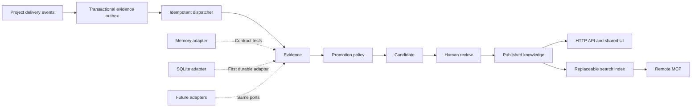

# Multica Knowledge, SQLite, and MCP handoff

## Status

The accepted product and architecture decisions have been implemented on the
current feature branch. The staged delivery record lives in
[`docs/plans/knowledge-sqlite-mcp-implementation.md`](../plans/knowledge-sqlite-mcp-implementation.md),
and configuration and recovery guidance lives in
[`docs/knowledge.md`](../knowledge.md).

Multica is the product boundary. The `team_control` knowledge catalog, governed
Markdown proposals, review, provenance, and revision-conflict behavior are
reference material, not code or application shells to copy.

## Architecture

## Knowledge sources

Knowledge is accumulated from Project goals and scope, Issue requirements and
acceptance, Task execution results, explicit decisions in comments, deliverable
revisions, acceptance conclusions, retrospectives, and manual proposals.

Every source becomes a normalized evidence envelope containing stable identity,
workspace and optional Project identity, source type and revision, actor, event
time, normalized content, provenance, checksum, and an idempotency key.

## Governance

- Deterministic, terminal, validated facts may be promoted automatically.
- Goals, decisions, constraints, requirements, and procedures require review.
- Lessons require an existing Project lead or workspace manager capability.
- Conflicts, low-confidence content, and missing provenance are quarantined.
- Published content is revisioned and never silently overwritten.
- Superseded revisions remain available for history.

## Storage boundary

The first durable adapter uses `database/sql` and the repository's existing
`modernc.org/sqlite` dependency. SQLite stores only knowledge-module data and
canonical external IDs. It does not replace Multica's primary database and does
not use foreign keys to connect to primary entities.

SQLite owns adapter-local schema versions, WAL, busy timeout, controlled write
connections, FTS5 capability detection, rebuildable search indexes, and safe
backup/restore. Domain and application packages contain no SQL or driver types.

Primary-store writes and knowledge writes are never treated as one transaction.
A primary-store transactional outbox retains evidence until SQLite acknowledges
an idempotent delivery.

## Authorization

All access is workspace-scoped and revalidates canonical Multica membership.
Optional Project identity must belong to the same workspace.

- Authorized members may read published knowledge.
- Authorized members may propose candidates.
- Existing owners/admins and applicable Project leads may review.
- Ordinary members cannot inspect candidates, role capability matrices,
  permission descriptions, or governance configuration.
- No parallel "knowledge administrator" role is introduced.

## MCP boundary

The remote MCP endpoint uses Streamable HTTP, OAuth 2.1 protected-resource
metadata, and a PAT-compatible path through the same authorization checks.

Initial scopes:

- `knowledge:read`
- `knowledge:candidate:read`
- `knowledge:propose`

Initial tools:

- `knowledge_search`
- `knowledge_list`
- `knowledge_get`
- `knowledge_propose`

MCP does not expose approval, rejection, role management, permission management,
workspace configuration, or runtime agent behavior.

## Recovery

- Disabling knowledge must not disable the six core domains.
- SQLite failure leaves source evidence queued for retry.
- Schema upgrades require a safe checkpoint or backup.
- Search data is rebuilt from authoritative knowledge records.
- Recovery never deletes evidence or clears the database as a shortcut.

## Completion evidence

The final report must include the implemented boundaries, SQLite schema version
and capabilities, outbox health, MCP endpoint and scopes, authorization behavior,
actual test commands and results, skipped checks, known limitations, commit IDs,
and confirmation that no runtime agent behavior was reintroduced.
