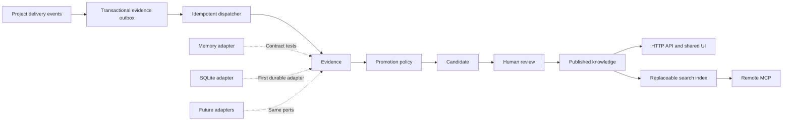

# Multica Knowledge, SQLite, and MCP handoff

## Status

The accepted product and architecture decisions have been implemented for the
SQLite-local composition and the default PostgreSQL service composition on the
current feature branch. PostgreSQL remains the primary six-domain store and
SQLite remains the first replaceable knowledge adapter. The staged delivery
record lives in
[`docs/plans/knowledge-sqlite-mcp-implementation.md`](../plans/knowledge-sqlite-mcp-implementation.md),
and configuration and recovery guidance lives in
[`docs/knowledge.md`](../knowledge.md).

Multica is the product boundary. The `team_control` knowledge catalog, governed
Markdown proposals, review, provenance, and revision-conflict behavior are
reference material, not code or application shells to copy.

## Architecture

## Knowledge sources

Knowledge is accumulated from Project goals and scope, Issue requirements and
acceptance, Task execution results, explicit decisions in comments, deliverable
revisions, acceptance conclusions, retrospectives, and manual proposals.

Every source becomes a normalized evidence envelope containing stable identity,
workspace and optional Project identity, source type and revision, actor, event
time, normalized content, provenance, checksum, and an idempotency key.

## Governance

- Deterministic, terminal, validated facts may be promoted automatically.
- Goals, decisions, constraints, requirements, and procedures require review.
- Lessons require an existing Project lead or workspace manager capability.
- Conflicts, low-confidence content, and missing provenance are quarantined.
- Published content is revisioned and never silently overwritten.
- Superseded revisions remain available for history.
- A revision proposal records the target entry and target revision; approval
  fails with a conflict when the published entry advanced in the meantime.

## Storage boundary

The first durable adapter uses `database/sql` and the repository's existing
`modernc.org/sqlite` dependency. SQLite stores only knowledge-module data and
canonical external IDs. It does not replace Multica's primary database and does
not use foreign keys to connect to primary entities.

SQLite owns adapter-local schema versions, WAL, busy timeout, controlled write
connections, FTS5 capability detection, rebuildable search indexes, and safe
backup/restore. Domain and application packages contain no SQL or driver types.

Primary-store writes and knowledge writes are never treated as one transaction.
A primary-store transactional outbox retains evidence until SQLite acknowledges
an idempotent delivery.

## Authorization

All access is workspace-scoped and revalidates canonical Multica membership.
Optional Project identity must belong to the same workspace.

- Authorized members may read published knowledge.
- Authorized members may propose candidates.
- Existing owners/admins and applicable Project leads may review.
- Ordinary members cannot inspect candidates, role capability matrices,
  permission descriptions, or governance configuration.
- No parallel "knowledge administrator" role is introduced.

## MCP boundary

The remote MCP endpoint uses Streamable HTTP, OAuth 2.1 protected-resource
metadata, and a PAT-compatible path through the same authorization checks.

Initial scopes:

- `knowledge:read`
- `knowledge:candidate:read`
- `knowledge:propose`

Initial tools:

- `knowledge_search`
- `knowledge_list`
- `knowledge_get`
- `knowledge_propose`

MCP does not expose approval, rejection, role management, permission management,
workspace configuration, or runtime agent behavior.

## Recovery

- Disabling knowledge must not disable the six core domains.
- SQLite failure leaves source evidence queued for retry.
- Schema upgrades require a safe checkpoint or backup.
- Search data is rebuilt from authoritative knowledge records.
- Recovery never deletes evidence or clears the database as a shortcut.

## Completion evidence

Recorded on 2026-07-31 for branch `codex/multica-six-domain-baseline`.

Implemented boundaries:

- Knowledge remains a workspace capability outside the six primary domain
  stores. SQLite adapter schema version 2 enables WAL, a busy timeout,
  controlled writers, adapter-local migrations, and optional FTS5 detection;
  it has no cross-database foreign keys.
- The default PostgreSQL service records evidence in
  `knowledge_evidence_outbox` inside Project, Issue, and Task source
  transactions. The dispatcher replays source-validated historical evidence
  even if its Project is deleted before SQLite recovers.
- `GET /api/knowledge/health` reports enabled/available state, SQLite
  capabilities, and outbox pending, failed, last-delivery, and last-error data
  to owners/admins. Explicitly disabling knowledge reports `enabled: false`
  without disabling the six primary domains.
- HTTP routes are mounted under `/api/knowledge`. Remote MCP is mounted at
  `/mcp/{workspaceSlug}/knowledge`, with protected-resource metadata under
  `/.well-known/oauth-protected-resource`. Its scopes are `knowledge:read`,
  `knowledge:candidate:read`, and `knowledge:propose`.
- Members may read published knowledge and propose candidates. Owners/admins
  review globally; Project leads review only led Projects. Ordinary members
  cannot list candidates or see permission explanations. PAT authorization
  revalidates canonical workspace membership. MCP has no review mutation.

Verification results:

- `go test ./... -count=1`: passed all runnable Go packages.
- `go vet ./...`: passed.
- `go test -race ./internal/knowledge/... ./internal/sqlitelocal ./internal/handler ./cmd/server -count=1`:
  passed.
- `pnpm typecheck`: passed all 6 applicable workspace tasks.
- `pnpm --dir packages/core exec vitest run --maxWorkers=1`: 72 files and
  492 tests passed.
- `pnpm --dir packages/views exec vitest run --maxWorkers=1`: 158 files and
  1,624 tests passed.
- `pnpm lint`: passed with four pre-existing React Hook warnings outside this
  work (desktop tab content, web login, zoom canvas, and search command).
- `pnpm verify:six-domains`: all six boundaries passed.
- `pnpm verify:no-runtime-agent-domains`: passed; no Runtime/Agent business
  modules or routes were reintroduced.

Skipped or environment-blocked checks:

- PostgreSQL-backed integration tests for outbox-to-SQLite delivery and Project
  lead PAT scope are committed and run automatically when `DATABASE_URL` is
  available. They were skipped in the final direct Go run because local
  PostgreSQL was unavailable.
- `make check` could not pass its PostgreSQL preflight because the Docker daemon
  was unavailable and the local Compose invocation rejected the repository
  configuration before starting PostgreSQL. A direct migration attempt then
  confirmed that localhost port 5432 was not accepting connections. Therefore
  PostgreSQL integration and Playwright E2E are not claimed as passed here.

Known limitations:

- Current automatic evidence producers cover Project, Issue, and Task lifecycle
  events. Comment decisions, deliverable revisions, acceptance conclusions, and
  retrospectives remain future producers behind the same evidence envelope.
- Backup, restore, and index rebuild are adapter capabilities and documented
  operational procedures; a standalone administration CLI is not yet included.

Implementation commits:

- `0d23d533` — plan and operations record.
- `544443b1` — SQLite governance and MCP foundation.
- `93aef33c` — shared workspace knowledge views.
- `093c6fdd` — governance and compatibility fixes.
- `6467aca0` — production composition and governance completion.
- `d87f4e5a` — revision history and Project lead review views.
- `a2f1acd2` — completed integration documentation.
- `2c1a08fa` — final production governance and review fixes.
