# Knowledge next-phase completion plan

## Document contract

| Field | Value |
| --- | --- |
| Status | `TGT-SLICE-01` complete in the current SQLite-only application mode; `TGT-SLICE-02` is ready to start |
| Delivery mode | `change-spec` |
| Coverage mode | `release-complete` for the capabilities selected below |
| Scope authority | Human-confirmed in the 2026-07-31 user request |
| Current baseline | `3f41e96662be` on `codex/multica-six-domain-baseline` |
| Reference evidence | `codex/backup-goclaw-pre-multica-20260729@695f52e3bcb2` |
| Architecture policy | Preserve the current Multica knowledge ports and deepen them |
| XP mode | Strict, one active vertical slice at a time |
| Verification claim | Planning/static only until each slice produces executable evidence |

This document is the approved next-stage change package for Multica knowledge.
It separates current facts from target behavior. Everything under **Current
baseline** is implemented today; everything under **Target** and **Delivery
plan** is proposed work and must not be represented as shipped before its
acceptance tests pass.

## Outcome

Complete the knowledge capability around project delivery so that Multica can:

1. retain decisions, deliverable revisions, acceptance conclusions, and
   retrospectives produced during implementation;
2. express contradictions, supporting evidence, derivation, withdrawal,
   review dates, expiry, and renewal without mutating published history;
3. discover Markdown, Git, uploaded files, and external documents through
   replaceable source adapters;
4. give enterprise reviewers a source catalog, conflict view, review-due view,
   and expired-knowledge view in the shared Web/Desktop UI;
5. measure when lexical search is no longer sufficient, and only then introduce
   an optional semantic index, hybrid ranking, and usage-feedback loop.

The release is complete when capabilities `TGT-CAP-01` through `TGT-CAP-07`
meet their acceptance chains. `TGT-CAP-08` and `TGT-CAP-09` are intentionally
deferred behind the measurable search gate defined later in this document.

## Non-negotiable boundaries

- Workspace, Member, Project, Issue, Task, and Skill remain the six core
  domains. Knowledge remains a workspace capability with an optional Project
  scope.
- Do not restore Runtime/Agent business modules, routes, context bundles,
  runner releases, or automatic agent prompt injection.
- Do not create a second user, membership, role, or permission system.
  Owners/admins review workspace-wide; Project leads review only their Projects.
- Ordinary members must not see candidate queues, permission descriptions,
  role matrices, connector credentials, raw connector configuration, or source
  errors that reveal private infrastructure.
- PostgreSQL remains the default six-domain source store. SQLite remains the
  first knowledge adapter, not the knowledge-domain contract.
- Source adapters discover and read snapshots. They never become the database
  of published knowledge and never write published records directly.
- No database foreign keys or cascade actions. Relationships and cleanup are
  enforced by application transactions.
- Every PostgreSQL index migration uses `CREATE [UNIQUE] INDEX CONCURRENTLY`,
  with one index statement per migration file.
- Published revisions are immutable. Relations and lifecycle changes are
  separately audited and use optimistic concurrency.
- External document adapters must not become an arbitrary URL fetch or SSRF
  surface. Credentials stay in the existing integration/secret boundary, not
  in the knowledge adapter.

## Current baseline

The current implementation already provides:

- the `Evidence -> Candidate -> Review -> Published Knowledge` lifecycle;
- immutable published revisions and stale-target conflict detection;
- memory and SQLite repository/search adapter contracts;
- SQLite schema version 2, WAL, busy timeout, FTS5 detection, backup, and index
  rebuild;
- PostgreSQL and SQLite source outboxes with idempotent delivery;
- Project, Issue, and terminal Task lifecycle evidence;
- workspace member read/propose access and owner/admin/Project-lead review;
- shared Web/Desktop browse, detail, source, revision, proposal, and review
  surfaces;
- Streamable HTTP MCP read/list/get/propose tools with workspace authorization.

The current gaps are recorded in
[`docs/knowledge.md`](../knowledge.md): comment decisions, deliverable
revisions, explicit acceptance conclusions, retrospectives, lifecycle aging,
relationship/conflict management, connector sources, and semantic retrieval.

## Target product model

### Actors

| ID | Actor | Allowed behavior |
| --- | --- | --- |
| `TGT-ACT-01` | Workspace member | Read effective published knowledge and sanitized sources; propose knowledge; capture an accessible comment as a decision |
| `TGT-ACT-02` | Project lead | All member behavior plus manage Project sources and review Project candidates, conflicts, review-due, and expired entries |
| `TGT-ACT-03` | Workspace owner/admin | Manage and review all workspace knowledge and sources; inspect connector and outbox health |
| `TGT-ACT-04` | Deployment operator | Configure connector providers, approved local roots, schedules, credentials, backup, and recovery outside product role management |

No new `knowledge_admin`, `memory_curator`, or reviewer-token identity is added.

### Journeys

| ID | Journey | Observable outcome |
| --- | --- | --- |
| `TGT-JRN-01` | Capture implementation knowledge | A durable evidence record and candidate are created from a delivery event without directly publishing content |
| `TGT-JRN-02` | Govern trust and freshness | A reviewer resolves a candidate, contradiction, review-due entry, expiry, withdrawal, or renewal with an audit record |
| `TGT-JRN-03` | Connect a source | A reviewer registers a safe source, previews discovered items, synchronizes selected snapshots, and observes success or a sanitized failure |
| `TGT-JRN-04` | Find trustworthy knowledge | A member searches only effective published knowledge and sees provenance, lifecycle warnings, and unresolved contradiction warnings |
| `TGT-JRN-05` | Decide whether semantic search is justified | An operator reviews aggregate search scale, latency, and relevance evidence and records a go/no-go decision |

### Capability inventory

| ID | Capability | Disposition | Criticality | Primary module |
| --- | --- | --- | --- | --- |
| `TGT-CAP-01` | Implementation-process evidence capture | In scope | Critical | Evidence ingestion |
| `TGT-CAP-02` | Replaceable source catalog and connector ports | In scope | Critical | Source integration |
| `TGT-CAP-03` | Knowledge relations and contradiction resolution | In scope | Critical | Governance |
| `TGT-CAP-04` | Lifecycle review, expiry, withdrawal, and renewal | In scope | Critical | Governance |
| `TGT-CAP-05` | Source/conflict/staleness management UI | In scope | High | Shared views |
| `TGT-CAP-06` | Lifecycle- and relation-aware API/MCP retrieval | In scope | High | Transport |
| `TGT-CAP-07` | Search-readiness telemetry and decision gate | In scope | High | Operations |
| `TGT-CAP-08` | Optional vector/hybrid retrieval | Deferred | High | Search adapter |
| `TGT-CAP-09` | Retrieved/cited/accepted/rejected feedback loop | Deferred | Medium | Search analytics |

Deferred capabilities have an explicit activation decision in **Semantic search
and feedback gate**. They are not part of the initial release implementation.

## Target architecture

```mermaid
flowchart LR
    A["Project implementation events"] --> B["Primary-store transaction and evidence outbox"]
    C["Source definitions"] --> D["Source connector registry"]
    D --> E["Markdown, Git, file, external adapters"]
    E --> F["Immutable source snapshot"]
    B --> G["Normalized evidence"]
    F --> G
    G --> H["Promotion policy"]
    H --> I["Candidate and human review"]
    I --> J["Published immutable revisions"]
    J --> K["Relations and lifecycle audit"]
    K --> L["Effective knowledge projection"]
    L --> M["HTTP, shared UI, and MCP"]
    L --> N["Lexical SearchIndex"]
    N -. "threshold gate" .-> O["Optional SemanticIndex and hybrid ranking"]
    M -. "privacy-safe aggregates" .-> P["Search readiness telemetry"]
```



### Ownership rules

- The six-domain primary store owns comments, issue state, project state, task
  state, and canonical member/Project identity.
- The knowledge repository owns evidence, candidates, published revisions,
  relations, lifecycle events, source definitions, source-item checkpoints, and
  connector sync history.
- A source adapter owns no domain state. It returns `SourceSnapshot` values and
  resumable cursors through a port.
- Search indexes are rebuildable projections. They are never authoritative.
- Source bytes are streamed and bounded. They are not retained as an unbounded
  duplicate document store. Normalized evidence and approved revisions retain
  the governed content required for history.

## Domain additions

### Implementation evidence sources

All sources use the existing canonical evidence envelope and idempotency
behavior. New builders must live in the knowledge domain; handlers only map
source-domain data into a builder input.

| Event | Source identity and revision | Knowledge kind | Default promotion |
| --- | --- | --- | --- |
| `comment.decision_proposed` | Comment ID plus comment `updated_at`/content checksum | `decision` | Candidate |
| `deliverable.revision_recorded` | Source definition, logical deliverable item, external revision, checksum | `reference` or explicitly selected governed kind | Candidate unless a deterministic terminal reference qualifies |
| `issue.acceptance_concluded` | Issue ID plus issue update revision and conclusion checksum | `requirement` or `lesson` | Candidate |
| `project.retrospective_recorded` | Project ID plus retrospective record ID/revision | `lesson` | Candidate |

Business rules:

- Capturing a comment as a decision is a proposal action, not a way to edit the
  comment or publish knowledge. It is idempotent for the same comment revision.
- A later comment edit may create a new candidate with a new source revision;
  the previous evidence remains immutable.
- An acceptance conclusion records result, rationale, evidence references, and
  actor. Moving an Issue to `done` without an explicit conclusion preserves
  backward compatibility but does not fabricate a human conclusion.
- A retrospective contains summary, successes, problems, lessons, and follow-up
  references. It belongs to the knowledge capability and Project scope; it does
  not create a seventh core domain.
- A deliverable is identified by a stable source item key. A changed revision or
  checksum creates new evidence; an unchanged snapshot is a no-op.
- Source mutation failure rolls back its primary transaction. Knowledge-store
  delivery failure leaves evidence in the outbox and never rolls back an
  already committed Project/Issue/Task/Comment operation.

### Knowledge relations

Add `KnowledgeRelation`:

| Field | Rule |
| --- | --- |
| `id` | Stable adapter-independent ID |
| `workspaceId` | Must match both entries |
| `projectId` | Empty for workspace knowledge; otherwise both entries must be compatible with the Project scope |
| `sourceEntryId` | Published entry that declares the relationship |
| `targetEntryId` | Different published entry in the same workspace |
| `type` | `contradicts`, `supports`, or `derived_from` |
| `note` | Required for `contradicts`; optional otherwise |
| `status` | `active` or `resolved` |
| `resolution` | Required when resolving a contradiction |
| `createdBy/createdAt` | Immutable audit identity/time |
| `resolvedBy/resolvedAt` | Set once through an optimistic resolution command |
| `revision` | Optimistic concurrency revision |

`supersedes` remains a revision relationship inside one published entry. It is
not duplicated as an entry-to-entry relation in this release.

Relationship rules:

- Relations are proposed with a candidate or added through a reviewed relation
  proposal; ordinary members cannot create an active relation directly.
- Self-relations, cross-workspace relations, and relations to non-published
  entries are rejected.
- An unresolved contradiction does not silently delete either entry. Search and
  detail responses expose a warning, and the reviewer queue counts it.
- Resolving a contradiction records the disposition and may optionally produce
  a revision proposal, withdrawal command, or supporting relation. It never
  rewrites either historical revision.

### Knowledge lifecycle

Add lifecycle fields to `KnowledgeEntry` and immutable
`KnowledgeLifecycleEvent` audit records.

| Concept | Representation |
| --- | --- |
| Effective interval | Optional `validFrom` and `validUntil` |
| Scheduled review | Optional `reviewAt` |
| Expiry | Optional `expiresAt`; computed `expired` flag |
| Withdrawal | Persisted `withdrawnAt`, `withdrawnBy`, and required reason |
| Renewal | Lifecycle event that advances lifecycle revision and sets a new review/expiry date |
| Optimistic control | `lifecycleRevision` checked by withdraw/renew commands |

Lifecycle rules:

- Expiry and review-due are computed from timestamps; no background job is
  required merely to flip a status at midnight.
- Default member search excludes withdrawn, not-yet-valid, and expired entries.
  Detail responses remain available for authorized historical inspection.
- Review-due entries remain searchable with a warning until reviewed, renewed,
  withdrawn, or expired.
- Withdrawal is not deletion. It removes the entry from effective search and
  records who withdrew it and why.
- Renewal does not mutate a content revision. It creates a lifecycle event and
  advances `lifecycleRevision`.
- Candidate approval may set initial lifecycle fields. Only owner/admin or the
  applicable Project lead may later withdraw or renew.

### Source catalog

Add adapter-independent records:

- `SourceDefinition`: workspace/Project scope, connector kind, presenter-safe
  label/URI, enabled state, sanitized configuration, creator, and timestamps.
- `SourceItemCheckpoint`: stable external item ID, latest revision/checksum,
  content type, last synchronized time, and last resulting evidence ID.
- `SourceSyncRun`: started/completed time, discovered/changed/unchanged/failed
  counts, resumable cursor, and sanitized error summary.
- `SourceSnapshot`: an in-memory connector result containing stable identity,
  revision, checksum, title, bounded content, media type, source time, and safe
  metadata.

The knowledge application depends on these ports:

```go
type SourceConnector interface {
    Kind() string
    Validate(context.Context, SourceDefinition) error
    Discover(context.Context, SourceDefinition, SourceCursor) (SourcePage, error)
    Fetch(context.Context, SourceDefinition, SourceItemRef) (SourceSnapshot, error)
}

type SourceRegistry interface {
    CreateSource(context.Context, SourceDefinition) (SourceDefinition, error)
    ListSources(context.Context, SourceQuery) (SourcePage, error)
    GetCheckpoint(context.Context, string, string) (SourceItemCheckpoint, error)
    CommitSync(context.Context, SourceSyncCommand) error
}
```

The exact method names may change during test-first design, but the dependency
direction may not: domain/application code imports no filesystem, Git, HTTP,
SQLite, or PostgreSQL driver types.

### Initial source adapters

| Adapter | Initial source | Stable revision | Safety constraints |
| --- | --- | --- | --- |
| Markdown | Approved Markdown file/directory | Content checksum plus optional source revision | Maximum 2 MiB per item, frontmatter parser limits, no traversal/symlinks, approved root only |
| Git | Existing Project repository resource | Commit and blob/object revision | Read-only checkout, bounded paths/files, no credentials in knowledge DB, no shell-derived user arguments |
| File | Existing Multica uploaded attachment/object | Object checksum/version and attachment ID | Reuse authenticated storage path, supported text types only, size/content validation |
| External document | Registered provider client | Provider-native version/ETag plus checksum | HTTPS/provider allowlist, private-network blocking, redirect revalidation, timeouts, response limits, sanitized errors |

Additional rules:

- Arbitrary local paths and arbitrary public URLs are not accepted product
  inputs. Deployment operators configure approved roots and provider clients.
- Markdown is a content adapter, not a database. Git is a revision source, not
  the governance transaction log.
- Deleting or disabling a source stops future synchronization but does not
  delete evidence, candidates, published revisions, or audit history.
- A source sync previews discovered changes before ingestion when initiated
  interactively. Automatic schedules, if enabled later, still create candidates
  according to promotion policy.
- The first release supports manual synchronization and idempotent restart.
  Periodic scheduling is a separate operational decision and is not implemented
  implicitly by this plan.

## Authorization and disclosure

| Surface | Member | Project lead | Owner/admin |
| --- | --- | --- | --- |
| Effective published knowledge | Read | Read | Read |
| Sanitized published source metadata | Read | Read | Read |
| Propose comment decision/knowledge | Yes | Yes | Yes |
| Candidate queue | No | Led Projects | Workspace |
| Conflict/review-due/expired management | No | Led Projects | Workspace |
| Source connector create/edit/sync | No | Led Projects | Workspace |
| Raw source config, connector errors, credentials | No | Sanitized only | Sanitized product view; secrets remain operator-only |
| Knowledge health | No | No | Workspace |

The UI hides unauthorized management surfaces entirely. A normal member receives
neither a disabled management tab nor an explanation of unavailable roles.
Server authorization remains authoritative even when the UI is manipulated.

## Target HTTP and MCP surface

The final path names may be adjusted for repository conventions, but the
behavioral boundary is fixed.

### HTTP API

- `GET /api/knowledge` adds effective-state filters and lifecycle warnings.
- `GET /api/knowledge/{id}` adds lifecycle and relation projections.
- `POST /api/knowledge/proposals` accepts optional relations and lifecycle.
- `POST /api/knowledge/{id}/withdraw` records a reviewed withdrawal.
- `POST /api/knowledge/{id}/renew` updates lifecycle dates with an expected
  lifecycle revision.
- `GET /api/knowledge/relations` lists scoped relations.
- `POST /api/knowledge/relations/{id}/resolve` resolves a contradiction.
- `GET /api/knowledge/stats` returns conflict, review-due, expired, source, and
  sync-health aggregates scoped to the caller.
- `GET /api/knowledge/sources` returns a sanitized source catalog.
- `POST /api/knowledge/sources` registers a source.
- `POST /api/knowledge/sources/{id}/preview` discovers changes without ingesting.
- `POST /api/knowledge/sources/{id}/sync` synchronizes selected/all discovered
  items idempotently.
- `POST /api/comments/{id}/knowledge-proposals` captures the current comment
  revision as a decision candidate.
- Acceptance conclusion and retrospective endpoints are mounted under their
  canonical Issue/Project resources and emit knowledge evidence through the
  existing source outbox.

Every new or changed API response receives a zod schema, camelCase boundary
transform, explicit fallback, and malformed-response test in `packages/core`.

### MCP

Keep the existing four safe tools. Extend their read responses with effective
lifecycle state, sanitized provenance, relation warnings, and citations.

- MCP may search/list/get/propose.
- MCP may propose relations and lifecycle metadata as part of a candidate.
- MCP may not create connectors, trigger sync, withdraw, renew, resolve
  contradictions, approve, reject, or manage permissions.
- Expired/withdrawn content is excluded from normal MCP search. Direct get may
  return historical content only when the product access policy allows it and
  must mark it as non-effective.

## Shared Web/Desktop experience

Extend the shared knowledge view rather than creating Web-only management code.

### Member experience

- Published list and detail show source, current revision, validity, review-due,
  expiry, and contradiction warnings.
- Comment actions expose “Propose as decision” where the member can access the
  comment.
- Members never see review, source-management, conflict-resolution, or
  permission-explanation surfaces.

### Reviewer experience

Add reviewer tabs or filters beside the existing review queue:

- Candidates
- Sources
- Conflicts
- Review due
- Expired

The overview shows scoped counts and last source synchronization status.
Reviewer actions include source preview/sync, contradiction resolution,
withdrawal, and renewal. Every consequential action requires a rationale and
displays the affected Project and knowledge entry before submission.

### UI structure

Split the current large knowledge page into focused shared components:

- `KnowledgeBrowseView`
- `KnowledgeDetailPanel`
- `KnowledgeProposalForm`
- `KnowledgeReviewQueue`
- `KnowledgeSourceCatalog`
- `KnowledgeConflictQueue`
- `KnowledgeLifecycleQueue`

Business queries and mutations stay in `packages/core`; view state stays in
component state or a `packages/core` Zustand store only when it must survive
navigation. `packages/views` remains router-agnostic.

## Persistence and migration

### Knowledge adapter migrations

Use ordered adapter-local migrations after current schema version 2:

- Version 3: lifecycle fields/events and relation records.
- Version 4: source definitions, item checkpoints, and sync runs.
- Version 5: reserved for usage feedback/semantic index metadata only after the
  semantic gate is approved; do not create placeholder vector tables now.

The memory adapter and SQLite adapter must pass the same repository, relation,
lifecycle, source-registry, and search contracts.

Migration rules:

- Existing published entries become effective with no expiry, no review date,
  lifecycle revision 1, and no relations.
- Existing SourceRefs remain valid. Source definitions are created lazily or by
  an explicit backfill command; migrations do not invent connector credentials
  or unsafe locators.
- Migrations are transactional and forward-only. A newer schema is rejected
  without modification.
- Backup/restore and restart tests cover versions 2 -> 3 -> 4.

### Primary PostgreSQL changes

Prefer existing source entities and the current evidence outbox. Add primary
columns/tables only when the source-domain record must remain independently
visible after knowledge is disabled, for example an explicit acceptance
conclusion. Such additions remain subordinate to Project/Issue/Comment, not new
top-level domains.

Every source-domain mutation:

1. validates workspace and Project scope;
2. writes the source record and evidence outbox in one PostgreSQL transaction;
3. rolls back both when the source write fails;
4. commits the source and pending evidence when the knowledge adapter is down;
5. replays idempotently after recovery.

### Expected implementation boundaries

| Area | Expected files/packages | Constraint |
| --- | --- | --- |
| Knowledge domain | `server/internal/knowledge/` with focused relation, lifecycle, source, and evidence modules | No SQL, HTTP, filesystem, Git, provider, or driver types |
| Memory adapter | `server/internal/knowledge/adapter/memory/` | Must pass the same public contracts as SQLite |
| SQLite adapter | `server/internal/knowledge/adapter/sqlite/` | Ordered schema versions; search remains rebuildable |
| Source adapters | `server/internal/knowledge/source/` or equivalent adapter package | Connector implementations depend inward on source ports |
| PostgreSQL capture | `server/internal/handler/comment.go`, `issue.go`, `project.go`, `knowledge_evidence.go`, and source transactions | Existing six-domain behavior stays available when knowledge is disabled |
| HTTP/MCP | `server/internal/handler/knowledge*.go` and shared transport helpers | Avoid a second local/production protocol implementation drifting apart |
| API model/hooks | `packages/core/types/knowledge.ts`, `knowledge/schema.ts`, queries, mutations, and client methods | Wire snake_case ends at zod/API boundary |
| Shared UI | `packages/views/knowledge/` plus comment/Issue/Project integration points | No `next/*`; Web and Desktop share business views |
| PostgreSQL migrations | `server/migrations/` only when primary source state changes | No FKs/cascades; concurrent indexes in isolated files |
| Documentation | `docs/knowledge.md`, this plan, and final handoff evidence | Proposed and implemented behavior remain clearly separated |

## Trace catalogs

### Atomic requirements

| ID | Requirement |
| --- | --- |
| `TGT-REQ-01` | Every implementation capture has stable source identity, revision, checksum, actor, event time, workspace, optional Project, and idempotency key |
| `TGT-REQ-02` | Source-domain commit and outbox append are atomic where a primary source record is changed |
| `TGT-REQ-03` | Relations validate workspace/Project compatibility and preserve both sides of a contradiction |
| `TGT-REQ-04` | Lifecycle filtering is clock-controlled, auditable, and optimistic-concurrency safe |
| `TGT-REQ-05` | Source connectors implement one adapter-independent discover/fetch/cursor/cancellation contract |
| `TGT-REQ-06` | Connector configuration and errors are presenter-safe and never expose secrets or private infrastructure to members |
| `TGT-REQ-07` | Reviewer queries and counts are workspace-wide for owner/admin and led-Project-only for Project leads |
| `TGT-REQ-08` | HTTP, MCP, and shared UI use the same effective-knowledge rules and relation/lifecycle projections |
| `TGT-REQ-09` | Lexical search remains deterministic and available when optional semantic infrastructure is absent |
| `TGT-REQ-10` | Vector/hybrid retrieval and feedback schemas remain absent until the documented gate is approved |

### Business rules

| ID | Rule |
| --- | --- |
| `TGT-RULE-01` | Delivery events and connectors produce evidence/candidates; none may directly publish governed kinds |
| `TGT-RULE-02` | Published content, evidence, reviews, relations, and lifecycle history are never hard-deleted as a recovery shortcut |
| `TGT-RULE-03` | Existing Multica membership and Project leadership are the only product authorization authorities |
| `TGT-RULE-04` | Source adapter failure cannot roll back a committed primary-domain transaction |
| `TGT-RULE-05` | Expired, withdrawn, and not-yet-valid entries are non-effective; review-due entries remain effective with warnings |
| `TGT-RULE-06` | Unresolved contradictions warn callers and enter reviewer queues; ranking never silently selects truth |
| `TGT-RULE-07` | Connector locators are safe references, not arbitrary filesystem or network access instructions |
| `TGT-RULE-08` | Search telemetry is aggregate and privacy-safe; raw query/content logging is out of scope |

### Exception matrix

| ID | Condition | Required behavior |
| --- | --- | --- |
| `TGT-EXC-01` | Knowledge adapter unavailable | Core mutation commits when valid; evidence remains queued; knowledge API reports unavailable |
| `TGT-EXC-02` | Connector partially fails | Previous checkpoint remains authoritative; sync run reports sanitized item failures; retry is idempotent |
| `TGT-EXC-03` | Unsafe path, URL, redirect, media, or size | Fail closed before content reaches evidence ingestion |
| `TGT-EXC-04` | Stale candidate/relation/lifecycle revision | Return conflict and preserve the winning state/history |
| `TGT-EXC-05` | Source deleted or disabled | Stop future sync; retain evidence and governed knowledge |
| `TGT-EXC-06` | Entry expired/withdrawn/not yet valid | Exclude from normal search; retain authorized historical detail |
| `TGT-EXC-07` | Unauthorized or cross-workspace request | Deny without leaking candidate, permission, source config, or scope data |
| `TGT-EXC-08` | Request/context cancellation | Propagate cancellation to connector, repository, search, HTTP, and MCP operations |

### Integration catalog

| ID | Integration | Boundary |
| --- | --- | --- |
| `TGT-INT-01` | PostgreSQL source outbox | At-least-once, idempotent evidence delivery to the knowledge repository |
| `TGT-INT-02` | Multica upload/object storage | Authenticated file snapshots; knowledge stores safe IDs/checksums, not credentials |
| `TGT-INT-03` | Project Git resource | Read-only commit/blob discovery through an adapter |
| `TGT-INT-04` | External document provider | Injected provider client with allowlist, timeout, size, redirect, and secret controls |
| `TGT-INT-05` | Remote MCP | Effective read/search/list/get and candidate-only propose behavior |
| `TGT-INT-06` | Shared Web/Desktop views | One `packages/views` experience using `packages/core` business state |

## Vertical delivery plan

Only one slice may be active. Each slice crosses UI, API, domain, data, and
tests; backend-only and frontend-only waves are not accepted as completed
stories.

### Implementation ledger

| Slice | Status | Executable evidence |
| --- | --- | --- |
| `TGT-SLICE-01` | Complete in SQLite-only mode | SQLite HTTP acceptance for comment creation/timeline, proposal, idempotency, edited revisions, comment provenance, cross-workspace denial, and ordinary-member candidate-list denial in `server/internal/sqlitelocal/server_test.go`; domain evidence/idempotency/candidate tests in `server/internal/knowledge/comment_decision_evidence_test.go`; shared Web/Desktop confirmation behavior in `packages/views/issues/components/comment-card-edit-gate.test.tsx`; Core wire-schema compatibility in `packages/core/knowledge/schema.test.ts` |
| `TGT-SLICE-02`–`TGT-SLICE-08` | Not started | Activate one vertical slice at a time after confirming its public test seams |

The application temporarily runs on SQLite for both six-domain business data
and governed knowledge. PostgreSQL code and migrations remain retained for a
future migration path, but PostgreSQL integration acceptance is not a release
gate while this operating mode is in force.

### `TGT-SLICE-01` — Comment decision capture

Capabilities: `TGT-CAP-01`, `TGT-CAP-06`  
Estimate: M  
Dependencies: current outbox/evidence service

Deliver:

- comment action and confirmation UI;
- workspace/Issue authorization and idempotent API;
- `comment.decision_proposed` evidence builder;
- source transaction/outbox write;
- candidate/source projection and Web/Desktop feedback.

Acceptance:

- Given an accessible comment, when a member proposes the current revision as a
  decision, then exactly one candidate with comment provenance is created.
- Given the same revision is submitted twice, then no duplicate evidence or
  candidate is created.
- Given the comment is edited, then a later capture uses a new source revision
  without mutating the first evidence.
- Given a cross-workspace comment or ordinary member candidate-list request,
  then access is denied without revealing the permission model.

### `TGT-SLICE-02` — Acceptance conclusion and retrospective

Capabilities: `TGT-CAP-01`, `TGT-CAP-06`  
Estimate: L  
Dependencies: `TGT-SLICE-01` evidence patterns

Deliver:

- structured acceptance conclusion during/after an Issue `done` transition;
- Project retrospective capture with summary, lessons, and evidence references;
- canonical source revisions, outbox delivery, and candidates;
- Issue/Project UI entry points and resulting knowledge links.

Acceptance:

- A `done` transition with a conclusion persists the source conclusion and
  evidence atomically.
- A legacy `done` transition without a conclusion remains valid and does not
  fabricate one.
- A retrospective creates a `lesson` candidate scoped to its Project.
- A failed knowledge delivery leaves committed source content queued and can be
  replayed after restart without duplication.

### `TGT-SLICE-03` — Source catalog and deliverable revisions

Capabilities: `TGT-CAP-01`, `TGT-CAP-02`, `TGT-CAP-05`  
Estimate: L  
Dependencies: source registry contract

Deliver:

- SourceDefinition/Checkpoint/SyncRun ports and memory/SQLite contracts;
- sanitized source catalog API and reviewer UI;
- uploaded-file adapter and logical deliverable revision capture;
- preview, sync, unchanged detection, restart, and recovery behavior.

Acceptance:

- A changed deliverable checksum/revision creates one new evidence record;
  unchanged content is reported as unchanged.
- Disabling/deleting a source does not delete governed knowledge.
- A Project lead can manage only led-Project sources; a normal member cannot see
  connector configuration or management actions.
- SQLite restart preserves catalog and checkpoint state.

### `TGT-SLICE-04` — Markdown, Git, and external document adapters

Capabilities: `TGT-CAP-02`, `TGT-CAP-05`  
Estimate: XL  
Dependencies: `TGT-SLICE-03`

Deliver:

- connector registry and contract test suite;
- Markdown approved-root adapter;
- Git Project-resource adapter;
- external provider-client adapter;
- preview/sync UI, cursor/checkpoint handling, health, and sanitized failures.

Acceptance:

- All adapters pass the same discover/fetch/idempotency/cancellation contract.
- Traversal, symlink, oversized file, unsupported media type, credential leak,
  private-network URL, and unsafe redirect tests fail closed.
- Git revisions remain stable across local checkout paths.
- Connector cancellation reaches filesystem/Git/provider work.
- A connector failure does not corrupt its previous checkpoint or published
  knowledge.

### `TGT-SLICE-05` — Relations and conflict governance

Capabilities: `TGT-CAP-03`, `TGT-CAP-05`, `TGT-CAP-06`  
Estimate: L  
Dependencies: current revision/candidate governance

Deliver:

- relation domain commands and memory/SQLite contracts;
- candidate relation proposal and approval;
- conflict counts, conflict queue, detail warnings, and resolution audit;
- relation-aware HTTP and MCP read projections.

Acceptance:

- Cross-workspace, self, missing, and non-published targets are rejected.
- Approving a contradiction creates one unresolved relation and increments the
  caller-scoped conflict count.
- Resolving with a stale relation revision returns conflict and preserves the
  first resolution.
- Search returns both effective entries with an unresolved-conflict warning;
  it never silently chooses a winner.

### `TGT-SLICE-06` — Lifecycle review, expiry, withdrawal, and renewal

Capabilities: `TGT-CAP-04`, `TGT-CAP-05`, `TGT-CAP-06`  
Estimate: L  
Dependencies: relation-compatible entry projection

Deliver:

- lifecycle fields, audit events, and optimistic commands;
- review-due/expired counts and queues;
- withdraw/renew UI, API, and search filtering;
- lifecycle warnings in detail and MCP reads.

Acceptance:

- Expired, withdrawn, and not-yet-valid entries are absent from normal member
  search but remain in authorized history.
- Review-due entries remain searchable with a warning.
- Renewal changes lifecycle dates without changing content revision history.
- Concurrent renewal/withdrawal with a stale lifecycle revision returns 409.
- Ordinary members cannot invoke lifecycle management or see its management
  queue.

### `TGT-SLICE-07` — Integrated governance dashboard and operations

Capabilities: `TGT-CAP-05`, `TGT-CAP-07`  
Estimate: M  
Dependencies: slices 03, 05, and 06

Deliver:

- scoped overview counts for sources, sync failures, conflicts, review due, and
  expired entries;
- shared component decomposition and locale parity;
- aggregate lexical-search latency, result-count, and zero-result metrics;
- backup/rebuild/source-sync operations documentation and health response.

Acceptance:

- Owner/admin counts cover the workspace; Project-lead counts cover only led
  Projects.
- Member UI contains no hidden/disabled management tabs or permission text.
- Search telemetry stores no raw query text, content, credential, or source
  bytes.
- Web and Desktop use the same business components and pass the same behavior
  tests.

### `TGT-SLICE-08` — Semantic-search decision spike

Capabilities: `TGT-CAP-07`; evaluates deferred `TGT-CAP-08` and `TGT-CAP-09`  
Estimate: bounded spike, not a feature release  
Dependencies: threshold gate satisfied

Deliver only after the gate:

- a curated relevance benchmark and privacy review;
- at least two adapter-independent semantic/hybrid approaches;
- measured quality, latency, cost, recovery, and portability comparison;
- a human go/no-go decision and, only if approved, a separate implementation
  Change SPEC.

This slice must not add a vector dependency, embedding provider, or usage-event
schema merely to make the plan look complete.

### Slice experience contracts

| Slice | UI / API / domain / data | Local demo | Success observable | Failure observable | Test IDs / fakes |
| --- | --- | --- | --- | --- | --- |
| 01 | Comment action / capture endpoint / decision evidence / outbox+knowledge adapter | Start app, capture a comment, open candidate queue | One candidate with comment source | Repeat is unchanged; cross-workspace is denied | `TGT-TEST-01`, `02`, `05`, `07`; unavailable knowledge fake |
| 02 | Issue/Project capture forms / conclusion+retro endpoints / evidence builders / source+outbox records | Complete an Issue with conclusion and record a Project retro | Two Project-scoped candidates with provenance | Source transaction rollback creates no evidence | `TGT-TEST-01`, `04`, `07`; failing outbox/store fake |
| 03 | Source catalog and deliverable form / source APIs / registry+sync service / SQLite checkpoints | Register an uploaded deliverable, preview, sync, restart | Changed snapshot appears once and source health is current | Unchanged snapshot is a no-op; disabled source cannot sync | `TGT-TEST-02`, `03`, `06`; storage snapshot fake |
| 04 | Connector preview/sync / provider APIs / connector registry / checkpoints | Preview one Markdown, Git, and external source | All adapters return stable safe snapshots | Traversal/private URL/oversize fails closed | `TGT-TEST-03`, `08`; fake Git/provider clients |
| 05 | Conflict queue/detail warnings / relation APIs / relation commands / relation tables | Approve and resolve a contradiction | Scoped count and warning update with audit history | Stale/cross-workspace resolution is rejected | `TGT-TEST-02`, `05`, `06`, `07`; clock/repository fakes |
| 06 | Due/expired views and actions / lifecycle APIs / lifecycle commands / lifecycle events | Expire, renew, and withdraw seeded entries using a test clock | Effective search and queues change predictably | Stale lifecycle revision returns conflict | `TGT-TEST-02`, `05`, `06`, `07`; injected clock |
| 07 | Shared dashboard / stats+health APIs / effective projection+metrics / aggregate counters | Review all scoped queues in Web and Desktop layouts | Counts, source health, and lexical metrics match scope | Member sees no management surface or raw diagnostics | `TGT-TEST-05`, `06`, `07`, `09`; role/project fixtures |
| 08 | Decision report only / benchmark harness / SemanticIndex spike / disposable benchmark data | Run lexical vs candidates on curated corpus | Recorded quality/latency/cost decision | Gate failure produces no production dependency/schema | `TGT-TEST-10`; offline corpus and provider fakes |

## Semantic search and feedback gate

Lexical FTS5 remains the default. Collect privacy-safe aggregates for at least
30 days before evaluating semantic search.

The spike becomes eligible when at least one scale signal is true for a
workspace:

- 10,000 or more effective published entries;
- 100,000 or more retained revisions/source checkpoints;
- lexical search p95 exceeds 250 ms under representative production load;
- the rebuildable lexical index exceeds 512 MiB.

Eligibility does not authorize implementation. The semantic/hybrid proposal
must also prove a relevance problem using at least 100 human-reviewed queries:

- lexical nDCG@10 below 0.75; or
- valid-query zero-result rate above 20%; or
- human relevance reviewers identify a repeatable synonym/concept recall gap.

Activation requires all of:

- at least 15% nDCG@10 improvement over lexical search;
- p95 hybrid latency at or below 500 ms for the benchmark corpus;
- deterministic lexical fallback when semantic infrastructure is unavailable;
- no change to Repository/SearchIndex authority or database portability;
- documented embedding retention, deletion, provider, cost, and privacy policy;
- explicit human approval of the provider/adapter decision.

If approved, introduce a `SemanticIndex` port and combine lexical and semantic
results through a documented rank-fusion policy. Do not embed provider SDK types
in domain records.

Usage feedback (`retrieved`, `cited`, `accepted`, `rejected`) activates only
with the semantic release and requires:

- at least 1,000 searches over the preceding 30 days;
- actor/workspace authorization and retention policy;
- no raw query/content logging by default;
- protection against one actor or automated caller dominating ranking;
- offline evaluation before any feedback affects result order.

## Test and verification contract

### Required test layers

- Domain unit tests: evidence builders, relation rules, lifecycle computation,
  promotion, idempotency, and optimistic conflicts.
- Adapter contract tests: memory and SQLite repository, relation, lifecycle,
  source registry, lexical search, backup, rebuild, and restart behavior.
- Connector contract tests: discover, fetch, cursor, unchanged, cancellation,
  size/path/network safety, and sanitized errors.
- PostgreSQL integration tests: source mutation + outbox atomicity, rollback,
  knowledge-store failure, restart, and replay.
- HTTP authorization tests: member, Project lead, owner/admin, cross-workspace,
  malformed body, and stale revision.
- MCP protocol tests: scopes, safe read/propose surface, lifecycle filtering,
  relation warnings, pagination, cancellation, and error behavior.
- `packages/core` API compatibility tests: zod parsing, camelCase transforms,
  fallbacks, and malformed responses.
- Shared view tests: loading, empty, error, ordinary member, Project lead,
  source preview, conflict resolution, expired/renewal, and locale parity.
- Browser smoke tests in both Web and Desktop-sized layouts for the integrated
  reviewer journey.

### Executable test catalog

| ID | Executable evidence |
| --- | --- |
| `TGT-TEST-01` | Evidence-source unit tests for decision, acceptance, retrospective, and deliverable revision identity/idempotency |
| `TGT-TEST-02` | Memory/SQLite expanded public contract suite |
| `TGT-TEST-03` | Connector discover/fetch/cursor/cancellation/security contract suite |
| `TGT-TEST-04` | PostgreSQL source transaction and outbox integration tests |
| `TGT-TEST-05` | HTTP authorization, malformed body, scope, and optimistic-conflict tests |
| `TGT-TEST-06` | `packages/core` schema/fallback/query/mutation compatibility tests |
| `TGT-TEST-07` | Shared Web/Desktop view behavior and locale-parity tests |
| `TGT-TEST-08` | Adversarial filesystem, Git, external-network, media, size, redirect, and credential-leak tests |
| `TGT-TEST-09` | Scoped stats, health, telemetry privacy, backup, migration, restart, and rebuild tests |
| `TGT-TEST-10` | Offline lexical-versus-semantic relevance, latency, fallback, and cost benchmark |

### Required commands before release acceptance

```bash
go test ./... -count=1
go vet ./...
go test -race ./internal/knowledge/... ./internal/sqlitelocal ./internal/handler ./cmd/server -count=1
pnpm typecheck
pnpm lint
pnpm test
pnpm verify:six-domains
pnpm verify:no-runtime-agent-domains
make check
```

Database-backed and Playwright checks must actually execute. A skipped test or
an environment preflight that exits before the suite does not count as passed.

## Traceability matrix

IDs in shortened columns retain the prefix named by the column header.

| Capability | Actors | Journeys | Requirements | Rules / exceptions | Integrations | Slices | Tests |
| --- | --- | --- | --- | --- | --- | --- | --- |
| `TGT-CAP-01` | 01, 02, 03 | 01 | 01, 02 | RULE-01, 04 / EXC-01, 04 | 01, 06 | 01, 02, 03 | 01, 04, 05, 07 |
| `TGT-CAP-02` | 02, 03, 04 | 03 | 05, 06 | RULE-04, 07 / EXC-02, 03, 05, 08 | 02, 03, 04 | 03, 04 | 02, 03, 08, 09 |
| `TGT-CAP-03` | 01, 02, 03 | 02, 04 | 03, 07, 08 | RULE-02, 03, 06 / EXC-04, 07 | 05, 06 | 05 | 02, 05, 06, 07 |
| `TGT-CAP-04` | 01, 02, 03 | 02, 04 | 04, 07, 08 | RULE-02, 03, 05 / EXC-04, 06, 07 | 05, 06 | 06 | 02, 05, 06, 07, 09 |
| `TGT-CAP-05` | 02, 03 | 02, 03 | 06, 07 | RULE-03, 07 / EXC-02, 07 | 02, 03, 04, 06 | 03–07 | 05, 06, 07, 08, 09 |
| `TGT-CAP-06` | 01, 02, 03 | 04 | 07, 08 | RULE-03, 05, 06 / EXC-04, 06, 07, 08 | 05, 06 | 01, 02, 05, 06 | 05, 06, 07 |
| `TGT-CAP-07` | 03, 04 | 05 | 09, 10 | RULE-08 / EXC-01 | 05 | 07, 08 | 09, 10 |
| `TGT-CAP-08` | 01, 03, 04 | 04, 05 | 09, 10 | RULE-08 / EXC-08 | Successor spec | Deferred | 10 |
| `TGT-CAP-09` | 01, 03, 04 | 04, 05 | 10 | RULE-08 / EXC-07 | Successor spec | Deferred | 10 plus successor privacy/bias tests |

## Rollout and rollback

- Guard new surfaces with capability-level feature flags during migration:
  `knowledge_sources`, `knowledge_relations`, and `knowledge_lifecycle`.
- Keep the current list/get/propose/review contract backward compatible while
  clients roll forward. New response fields are additive and optional during
  one compatibility window.
- Deploy schema readers before writers. Verify adapter backup before every
  schema-version increase.
- Disable connector sync independently from published knowledge access.
- Rollback disables new writers and UI actions; it does not delete new tables,
  relations, lifecycle events, sources, or evidence.
- Rebuild search projections from authoritative current revisions and effective
  lifecycle state after restore.

## Risks and spikes

| Risk | Control |
| --- | --- |
| External connector becomes SSRF/credential leak | Provider registry, allowlist, DNS/IP and redirect revalidation, secret boundary, bounded responses, adversarial tests |
| Source adapters leak transport types into domain | Contract tests and package-boundary review |
| Time-based expiry causes flaky behavior | Injected clock in domain/application tests; computed effective state |
| Contradictions are treated as automatic truth selection | Preserve both entries, explicit warnings, human resolution audit |
| Source sync duplicates candidates | Stable item/revision/checksum idempotency plus transactional checkpoint commit |
| New UI reveals enterprise permissions | Role-scoped server queries and absence tests for member surfaces |
| Semantic search is adopted prematurely | Hard scale/relevance gate and separate human-approved Change SPEC |
| Large knowledge page becomes harder to maintain | Split shared components while preserving router/package boundaries |

## Definition of release-ready

This next stage is release-ready only when:

- slices 01–07 are customer-accepted in order and each has RED/GREEN/refactor
  evidence;
- all selected capabilities have working UI/API/domain/data paths;
- cross-workspace and ordinary-member disclosure tests pass;
- memory and SQLite pass the same expanded contracts;
- PostgreSQL source/outbox integration tests actually run;
- connector safety and cancellation tests pass;
- backup, schema upgrade, restart, and search rebuild are verified;
- Web/Desktop shared views and all locales pass;
- six-domain and no-Runtime/Agent verification remains green;
- skipped semantic capabilities remain disabled unless the documented gate and
  a successor Change SPEC are approved.

Planning completeness does not imply implementation or release readiness.
