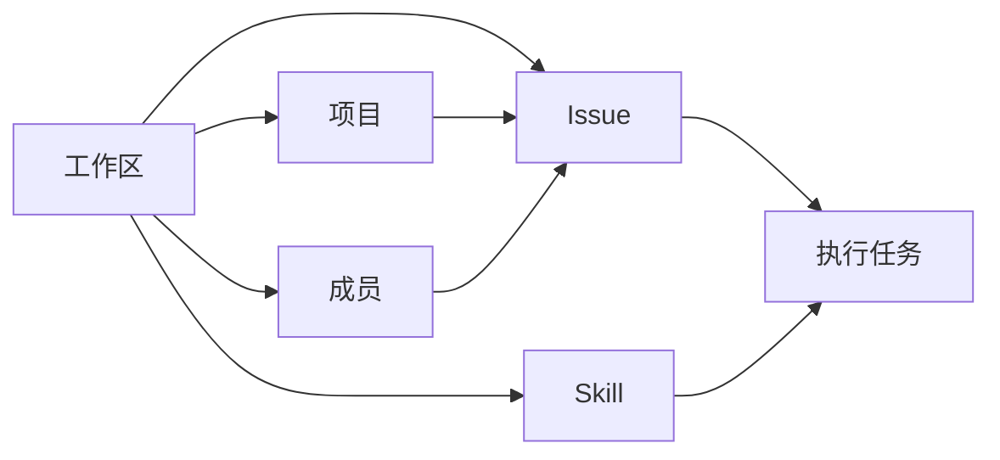

# Multica 六域基线

本基线把工作区、成员、项目、Issue、执行任务（task）和 Skill 定义为第一阶段可独立验收的产品切片。它不是一套平行实现，也不复制现有模型、API 或页面；六域继续使用 Multica 原生的数据模型、权限、事件、共享前端和 CLI，并保留智能体、运行时、评论、标签、附件、聊天、自动化与集成等依赖。

机器可读边界位于 [`six-domain-baseline.json`](six-domain-baseline.json)。运行以下命令可确认每个域的数据、后端、协议、客户端、界面、CLI、文档与测试入口仍然存在：

```bash
pnpm verify:six-domains
```

## 共同约束

- 工作区是租户和授权边界。工作区内查询必须按 `workspace_id` 过滤，HTTP 请求由工作区成员中间件校验。
- React Query 管理服务端状态；Zustand 只管理视图状态。工作区级 query key 必须包含 `wsId`。
- Issue 是团队协作的工作对象；执行任务是智能体的一次运行。一次 issue 可以产生多次执行任务，两者不得合并。
- 关系由应用层校验和清理，不新增数据库外键或级联操作。
- Web 与桌面端复用 `packages/core`、`packages/ui` 和 `packages/views`；移动端保持独立实现，但产品语义必须一致。

## 六域契约

| 域 | 权威数据 | 主要能力 | 产品入口 |
| --- | --- | --- | --- |
| 工作区 | `workspace`（含 `issue_counter`） | 创建、读取、更新、切换、离开、删除；slug 与 issue 前缀；工作区级授权 | 新建工作区、工作区设置、`multica workspace` |
| 成员 | `member`、`workspace_invitation` | `owner` / `admin` / `member`；邀请、改角色、移除、离开；至少保留一位 owner | 成员设置、成员详情、`multica workspace member` |
| 项目 | `project`、`project_resource` | CRUD、状态、优先级、负责人、日期、资源；与 issue 的一对多关系 | 项目列表与详情、`multica project` |
| Issue | `issue` 及标签、属性、评论等扩展表 | CRUD、编号、状态、优先级、多态负责人、父子层级、项目归属、批量与表格查询 | Issue 列表与详情、`multica issue` |
| 执行任务 | `agent_task_queue`、`task_message`、`task_usage`、`task_token` | 排队、领取、准备、运行、进度、完成、失败、取消、重试、租约、消息与用量 | Issue 执行记录、任务 transcript、守护进程协议 |
| Skill | `skill`、`skill_file`、`agent_skill` | CRUD、导入、文件管理、挂载智能体、本地发现、仓库级发现、按引用解析与缓存 | Skill 列表与详情、本地导入、`multica skill` |

## 域间关系



- 工作区拥有其余五域的数据边界。
- 成员可以成为 issue 负责人或项目负责人；智能体也可以承担这两种角色。
- 项目聚合 issue，删除项目只解除关联，不删除 issue。
- Issue 通过分配、评论提及、手动重跑等动作产生执行任务。
- Skill 挂载到智能体，并在执行任务准备阶段解析为不可覆盖仓库内容的 skill bundle。

## 验收范围

六域基线只声明现有 Multica 原生能力为第一阶段交付范围。其他 Multica 域继续保留并作为依赖运行，但不在本阶段单独扩展。验收由三层组成：

1. `pnpm verify:six-domains` 检查六域边界清单、受跟踪文件和关键路由/事件。
2. Go 窄测覆盖工作区与成员权限、项目校验、issue 路由、执行任务状态机和 skill bundle。
3. TypeScript 窄测覆盖 query/mutation、共享页面与执行记录；全仓 `pnpm typecheck`、`pnpm test` 和 `make test` 用于最终回归。

本次基线的实际检查结果和暂缓项记录在 [`six-domain-verification.md`](six-domain-verification.md)。
