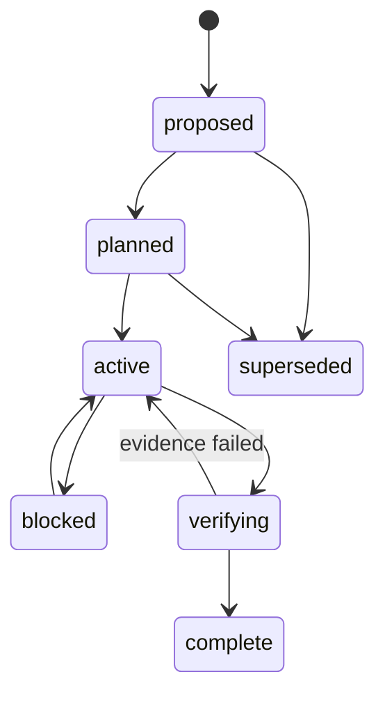

# Wave 更新管理

本文定义 GoClaw 的分波更新规则。它首先用于 Team Web Console 稳定化，
以后所有需要多个步骤、多个模块或多轮验证的更新也必须遵守同一规则。
恢复基线 `MVP-W00 r006` 已完成，当前机器可读入口是 `FE-W01 r012`。
recovered release 为 `0.8.0-pilot.1-recovered.1`；FE-W01 在该权威 base
上执行确定性、真实浏览器、ptrace 零出站和 credential owner 门禁。
`PILOT-W00` 继续 `blocked`，在 FE-W01 完成前不得启动三台 Runner 放行。

Wave 文档是计划、范围、门禁和证据索引，不替代运行时权威数据：

- Issue/WorkItem/Assignment 的权威来源仍是 TeamControl；
- Task revision、DoneGate 和 EvidencePackage 的权威来源仍是 Orchestrator Lite；
- 代码、commit 和 PR 的权威来源仍是 Git；
- Wave 只回答“为什么分这一步、这一步允许改什么、怎样证明可以进入下一步”。

## 不可绕过的规则

1. 先建立或更新 Wave 文档，再修改产品代码。
2. 当前只能有一个 `active` Wave。
3. 代码变更必须同时关联 `Wave-ID`、具体 `Issue-ID`、Task revision 和验证证据。
4. `active` 不等于允许任意改动；只允许文档中 `allowed_change_scope` 列出的范围。
5. W00 基线阶段只允许文档、诊断和测试夹具，不允许修复产品代码。
6. 未复现的问题保持 `reported` 或 `unverified`，不能直接写成根因或修复任务。
7. 范围、顺序、接口或验收标准变化时，必须先更新 Wave 文档和决策日志。
8. 没有可复核证据时，不得把 Wave 推进到 `verifying` 或 `complete`。
9. 紧急修复也不能事后补计划；至少先创建一个 Hotfix Wave，写明范围、风险、回滚和验证。
10. Wave 完成后只读保留。后续变化创建新 Wave，不静默改写历史结论。
11. 已批准的 `plan-rNNN.md` 不原地改写；实质变化创建下一 revision，并在 Journal 中记录替代关系。
12. Journal 只追加状态、偏差、决策和证据引用；原始日志仍留在 Trace、CI 或 EvidencePackage。

## 状态机



状态含义：

| 状态 | 含义 | 是否允许产品代码变更 |
|---|---|---:|
| `proposed` | 只有候选目标，范围和证据计划尚未冻结 | 否 |
| `planned` | 计划已写入文档，等待依赖或入口门禁 | 否 |
| `active` | 入口门禁通过，可按允许范围执行 | 取决于 Wave |
| `blocked` | 发现缺失决策、环境或外部依赖 | 否 |
| `verifying` | 实施停止，只收集和复核验收证据 | 否 |
| `complete` | 退出门禁和证据均通过 | 否 |
| `superseded` | 被新 Wave 取代，保留历史 | 否 |

状态迁移必须同步修改
[`wave-registry.json`](wave-registry.json)、对应 Wave 文档的进度日志和
[`evidence-index.md`](evidence-index.md)。

## 文件与稳定身份

| 文件 | 用途 |
|---|---|
| [`wave-registry.json`](wave-registry.json) | 机器可读的 Wave 顺序、状态、依赖和范围 |
| [`wave-template.md`](wave-template.md) | 新 Wave Plan revision 的必填模板 |
| [`wave-journal-template.md`](wave-journal-template.md) | 追加式执行 Journal 模板 |
| [`issue-register.md`](issue-register.md) | 用户报告、复现结果、根因状态和修复关联 |
| [`decision-log.md`](decision-log.md) | 顺序、范围、契约和风险决策 |
| [`evidence-index.md`](evidence-index.md) | 测试、截图、Trace、日志和 DoneGate 的索引 |
| `frontend-stability/fe-wNN/plan-rNNN.md` | 不可变的 Wave 计划 revision |
| `frontend-stability/fe-wNN/journal.md` | 追加式状态、变更、决策和证据索引 |

文件名使用英文 kebab-case。Wave ID 使用 `<TRACK>-WNN`，例如
`FE-W01`、`PILOT-W00`、`MVP-W00`；Evidence 使用
`<TRACK>-EVID-...`，Issue 使用 `<TRACK>-ISSUE-NNN`。文件移动或跨 Wave
不改变稳定 ID。

## 当前稳定化路线

| Wave | 状态 | 目标 | 产品代码 |
|---|---|---|---:|
| [`FE-W00`](frontend-stability/fe-w00/plan-r005.md) | `complete` | 可执行基线与首批 Issue 拆分 | 禁止 |
| [`MVP-W00`](recovery/mvp-w00/plan-r006.md) | `complete` | 权威源码、可重复发布与可追溯最终验收 | 禁止 |
| [`FE-W01`](frontend-stability/fe-w01/plan-r012.md) | `active` | recovered base 登录、WebSocket、浏览器、ptrace 与凭据闭环 | 仅已复现范围 |
| [`FE-W02`](frontend-stability/fe-w02/plan-r001.md) | `planned` | 所有页面读取 loader 与 RPC 返回契约 | 受限 |
| [`FE-W03`](frontend-stability/fe-w03/plan-r001.md) | `planned` | 对话、规格、审批、开发和 Harness 命令链 | 受限 |
| [`FE-W04`](frontend-stability/fe-w04/plan-r001.md) | `planned` | 状态呈现、响应式、可访问性和恢复体验 | 受限 |
| [`FE-W05`](frontend-stability/fe-w05/plan-r001.md) | `planned` | 集成、安全、回归和发布就绪 | 禁止新增功能 |
| [`PILOT-W00`](pilot-readiness/pilot-w00/plan-r006.md) | `blocked` | Runner、治理、前端、恢复与三人并发试点 | 禁止 |

顺序是依赖顺序，不是日期承诺。W00 结束前不开始修复；若 W00 证明某个
问题属于后端契约、部署或数据迁移，仍保留原 Issue ID，但在相应 Wave
中明确责任边界。

## 每次工作的最小流程

1. 在 `issue-register.md` 登记用户可观察症状。
2. 在 W00 复现，并记录环境、请求、响应、控制台和截图。
3. 更新目标 Wave 的影响分析、步骤与验收证据。
4. 通过入口门禁后，把 Wave 设为 `active`。
5. 创建冻结 Task，携带 `Wave-ID` 和 `Issue-ID`。
6. 实施一个最小增量，执行确定性验证。
7. 把证据写入 `evidence-index.md`，Wave 文档只引用证据，不复制运行时日志。
8. 退出门禁通过后进入下一 Wave。

提交或 PR 除现有 trailers 外应增加：

```text
Wave-ID: FE-W01
Wave-Revision: r009
Wave-Step: FE-W01-S11
Issue: FE-ISSUE-003
Issue: FE-ISSUE-004
Issue: FE-ISSUE-005
Issue: FE-ISSUE-010
```

`Issue` 沿用现有 `link-pr` 契约；若一个提交涉及多个问题，每个 `Issue`
单独一行。禁止用一个笼统 Issue 掩盖不相关改动。

## 当前执行边界

本目录和 `AGENTS.md` 先形成仓库级失败关闭政策；当前运行时尚未实现
“freeze 时验证 active Wave plan revision/SHA/审批”的服务器硬门禁。
因此不得把 Wave 自动强制描述为已实现能力。若要自动化，必须建立独立
Governance Wave，补 Document kind、revision/checksum、审批、Task 关联和
`dev.task.freeze` 校验，不能在前台修复 Wave 中顺带实现。
