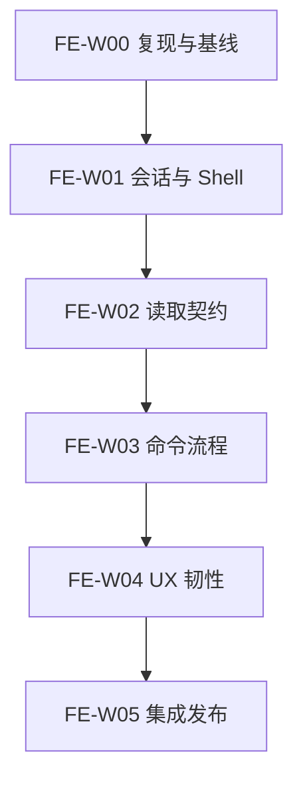

# Team Web Console 稳定化 Track

- Track ID：`FE-STABILITY-2026-07`
- 基线版本：`0.7.0`
- 当前 Wave：`FE-W01`
- 当前计划：[`FE-W01 plan-r010`](fe-w01/plan-r010.md)
- 当前执行状态：W01 `blocked`，等待 `MVP-W00` 建立 recovered Git base；
  r010 不授权产品变更。历史 `FE-DEC-013` 与 r009 已通过 Wave、安全和
  文档终审。R6 技术 Gate 通过但 traceability 失败，已在 credential/runtime
  前停止并只读保留；R7 从 `5160273` 完成可追溯重建，S12/EVID020 的完整
  Task tuple、trailers、11/11 manifest 与确定性 Gate 已通过三路独立复核。
  S11 下载完整性通过，但当前容器、首次授权宿主与用户再次触发的授权宿主
  重试均拒绝 ptrace，EVID018 已失败关闭为 `environment-blocked`；未创建
  credential/runtime。
  `FE-ISSUE-007` credential owner 仍未解析，因此仍禁止产品提交和发布。
- 用户报告：[`FE-ISSUE-001`](../issue-register.md)
- 注册表：[`wave-registry.json`](../wave-registry.json)

本 Track 只处理已复现的 Team Web Console 异常和所需回归基础设施，
不增加新业务功能，不把可选 Obsidian 适配器恢复为默认控制面。

## 顺序

每个目录包含冻结 `plan-rNNN.md` 与追加式 `journal.md`。W00 已完成可执行
基线与首批 Issue 拆分；未验证页面仍由 `FE-ISSUE-001` 跟踪，不能因为进入
W01 就推断为正常。

当前已确认：

- `FE-ISSUE-002`：Gateway session 测试使用旧返回值签名；
- `FE-ISSUE-003`：Vite `/auth.changeOrigin=true` 破坏严格同源登录；
- `FE-ISSUE-004`：DEV TeamClient 绕过同源 `/ws` proxy。
- `FE-ISSUE-005`：`/dashboard/` 被内部 `/index.html` 映射触发 301 自循环。
- `FE-ISSUE-006`：WeWork channel test 固定 sleep 十分钟，阻断全仓 Gate；
- `FE-ISSUE-007`：该版本化 test 含 credential-shaped Bot/Secret literals，
  有效性未知，按潜在 S0 处理。
- `FE-ISSUE-008`：默认 Markdown ingestion 把 provenance kind 推断为
  `markdown-markdown`，阻断全仓 Gate。

当前 Evidence：

- [`FE-EVID-W00-007`](fe-w00/authority-runtime-reproduction.md)：Git、工具链、
  build、Gateway 编译阻断与真实 Vite HTTP/WS 协议复现；
- `FE-EVID-W01-001`：Node TeamClient transport tests；
- `FE-EVID-W01-002`：Gateway Origin/CSRF/session/token/RBAC tests；
- `FE-EVID-W01-003`：真实 Browser 回归，当前 blocked；
- `FE-EVID-W01-004`：真实 Vite `/auth` 204 与 `/ws` 101；
- `FE-EVID-W01-005`：build、lockfile 与 tracked/untracked scope gate。
- [`FE-EVID-W01-006`](fe-w01/s01-red-tests.md)：transport 与 session 先失败测试；
- [`FE-EVID-W01-007`](fe-w01/s04-dashboard-shell-reproduction.md)：
  dashboard shell 301 自循环、base 归属与根因；
- [`FE-EVID-W01-008`](fe-w01/s06-dashboard-shell-red-green.md)：S06
  route/security/cache red→green，等待独立复核；
- [`FE-EVID-W01-009`](fe-w01/s04-full-go-channels-reproduction.md)：
  channels timeout、网络型测试与 credential hygiene 脱敏根因；
- [`FE-EVID-W01-010`](fe-w01/s07-deterministic-channel-green.md)：
  S07 synthetic、无网络、无等待测试和 R3 green；
- `FE-EVID-W01-011`：credential owner 撤销/轮换或从未有效证明，等待外部负责人。
- [`FE-EVID-W01-012`](fe-w01/s04-memory-catalog-reproduction.md)：
  全仓 Catalog provenance 失败、重复复现与根因；
- [`FE-EVID-W01-013`](fe-w01/s09-catalog-provenance-red-green.md)：
  S09 Catalog 推断矩阵 red→green 与 Revision 4 全量确定性 Gate。
- [`FE-EVID-W01-014`](fe-w01/s10-r5-deterministic-revalidation.md)：
  r007/R5 source-first、全量确定性、scope 与 lockfile 重验，当前 collecting；
- `FE-EVID-W01-015`：r009/R7 本地 Playwright synthetic runtime、桌面/移动、
  登录/connected/刷新/退出、sentinel 与脱敏截图，当前 planned。
- [`FE-EVID-W01-016`](fe-w01/s10-runtime-provider-preflight.md)：真实
  Gateway provider constructor 预检与 r007 安全停止，已通过独立复核；
- [`FE-EVID-W01-017`](fe-w01/s11-r6-deterministic-revalidation.md)：r008/R6
  技术 Gate 通过，但 traceability 治理阻断，不能作为后续验收链。
- [`FE-EVID-W01-018`](fe-w01/s11-inert-provider-environment-blocked.md)：
  r009/R7 下载执行树完整性通过，但 Gateway syscall Gate 在用户再次要求
  启动真实浏览器后的同合同重试中仍因 ptrace 被拒而
  environment-blocked；未进入 inert config/runtime，当前 failed。
- [`FE-EVID-W01-019`](fe-w01/s12-r6-traceability-preflight.md)：R6 freeze
  与 commit trailer 缺口，runtime 前安全停止，已通过独立复核。
- [`FE-EVID-W01-020`](fe-w01/s12-r7-traceable-deterministic-revalidation.md)：
  r009/R7 完整 tuple/trailers、source-first、11/11 manifest 与全量确定性
  Gate 已通过代码、安全与文档独立复核，当前 passed。

协议复现只授权最小 transport 修复，不代表真实页面交互或视觉已经通过。
