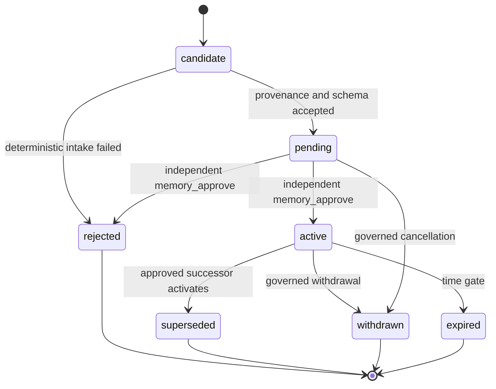

# TC-W02 目标领域与合同

本文件冻结目标语义，不授权实现。

## 权威边界

### Team Control 逻辑权威

Team Control 唯一决定：

- principal、team、project、repository、component 与 membership；
- policy layer、resolved policy、mandatory validation 与 provenance；
- Knowledge ID、scope、revision、checksum、owner、classification、
  visibility、lifecycle、relations、evidence refs 和审批决策；
- Context Manifest 的输入身份、选择结果、预算快照、资源引用和 hash；
- Runner lease 对 MCP audience 的授权；
- feedback 去重/来源校验/项目隔离后创建的 candidate；
- 人工审批、supersession、withdrawal、expiry 和 audit event。

### 唯一正文与索引边界

- 正文 blob 只写入一个 content-addressed object store，key 为
  `sha256:<hex>`；Team Control KnowledgeRevision 保存 blob ref、size、
  media type 和 checksum。
- object store 不保存“active”布尔值，不执行项目授权，不接受 Runner
  直接写 active；这些只由 Team Control 决定。
- 检索索引只订阅已授权的 immutable revision event，可完全丢弃重建；
  index document 必须含 knowledge ID、revision、checksum、scope 和
  visibility version。
- Markdown、Git、Harness、Obsidian 和旧 Catalog 都是 source adapter 或
  migration source，不是并行 active truth。

## Policy 合同

### 层与解析顺序

```text
global defaults
  → team
  → project
  → repository
  → component
  → validate against global mandatory constraints
```

`global defaults` 是可覆盖默认值。`global mandatory constraints` 不是合并
层；它在所有覆盖完成后对 resolved result 做最终校验，任何违反都失败关闭。

### Policy 数据

`PolicyLayer` 至少包含：

- `id`、`kind` (`global_default|team|project|repository|component`)；
- `scope_id`、`name`、`revision`、`schema_version`；
- canonical rules、checksum、enabled；
- owner、created/approved identity 与 timestamps；
- source reference 与 supersedes；
- 对每个 rule 的 merge strategy（默认 exact-key replace；复杂类型须显式
  schema）。

`GlobalMandatoryConstraint` 至少包含：

- stable ID/revision/checksum；
- constraint expression 和 schema version；
- severity 固定为 fail-closed；
- owner/approval/source；
- violation code 与安全脱敏消息。

mandatory set 由独立的 global authority 管理：

- 只有 server-resolved `global_policy_admin` 可创建 candidate；
- activation/disable 必须由与创建者不同的 `global_policy_approve` 人工角色
  compare-and-swap 批准，项目/team policy 管理员没有该权限；
- 每个 revision 不可变，不能原地替换或删除；disable 也是带理由、反方论点
  和 Evidence 的新治理事件；
- 控制面维护单调 `mandatory_set_epoch`，完整 set 的 ordered
  ID/revision/checksum 和 epoch 一起冻结进 ResolvedPolicy；
- 缺 set、epoch 倒退、revision/checksum 不匹配或审批链不完整均失败关闭。

### ResolvedPolicy

输出必须 canonical serialize，并包含：

- target project/repository/component；
- ordered layer refs（ID/revision/checksum/scope）；
- 每个最终 rule 的 value 与 winning source；
- 被覆盖来源的有序 refs；
- mandatory constraint refs；
- `mandatory_set_epoch` 和完整 ordered set hash；
- validation result（`valid` 或 fail-closed error；invalid 不生成可执行
  Context）；
- resolver version、resolved hash、resolved_at（不进入 hash 的观察字段须
  明确排除）。

稳定 ID：

```text
resolved_policy_id = "rpol-" + first32(
  sha256(domain("resolved-policy", schema_version) ||
         canonical_resolved_policy_material)
)
```

所有目标 hash 共用规范算法：

- canonical bytes 使用 RFC 8785 JSON Canonicalization Scheme（JCS）；
- material schema 明确列出允许字段，未知字段、重复 key、非 UTF-8、非有限数
  和非规范 timestamp 一律拒绝；
- hash 输入是
  `UTF8("goclaw:" + domain + ":v" + schema_version + "\u0000") ||
  JCS(material)`，不同对象域不可复用 digest；
- observation fields（如 `resolved_at`、display label）明确排除，所有授权、
  scope、revision、checksum、budget 和 resource refs 必须纳入；
- Go/TypeScript/其他实现共享 committed golden vectors，包含 Unicode、数字、
  map/list ordering、空值、错误输入和 cross-domain negative cases。

### 冲突矩阵

| 场景 | 结果 | 原因 |
|---|---|---|
| global default `max_files=20`，project `max_files=10` | `10` | 项目可覆盖默认值 |
| global default `style=standard`，component `style=strict` | `strict` | 后层覆盖默认 |
| team 和 project 定义同 key | project 胜出，保留 team provenance | 固定层次 |
| 同层同 name 多 revision | 只取已批准、enabled 的最高合法 revision | 版本选择确定 |
| 同层不同 name 同 priority 同 key | 按 priority/name/revision/ID 稳定排序；后者胜出并记录冲突 provenance | 输出可重放 |
| 下层要求 `allow_secret_uri=true`，mandatory 禁止 | 失败关闭，不生成 Context | mandatory 最终校验 |
| project 放宽 mandatory `require_independent_review=false` | 失败关闭 | mandatory 不可覆盖 |
| mandatory schema/constraint checksum 不匹配 | 失败关闭 | 不猜测安全约束 |
| 某 layer 非 canonical 或 checksum 错 | 失败关闭 | 内容寻址完整性 |
| 客户端传入不属于项目的 repository/component | not found/forbidden，不能扩大 scope | 服务器授权 |

## Knowledge 合同

### 聚合与 revision

`KnowledgeRecord`（durable identity）：

- `id`；
- `scope_kind=global|project`；
- `scope_id`（global 时使用固定 global authority ID，不使用 `"*"`）；
- owner principal/team；
- category、visibility policy；
- current active revision ref（可空）；
- created/updated audit identity。

`KnowledgeRevision`（immutable content identity）：

- `knowledge_id`、单调 revision、schema version；
- checksum、body ref、size、media type；
- source URI/kind/revision/checksum/captured_at；
- title/abstract/classification/subjects/facets；
- visibility snapshot；
- confidence；
- valid_from、valid_until、expires_at、review_at；
- supersedes、contradicts、derived_from、supports；
- evidence citations；
- creator、candidate origin；
- canonical hash。

正文、checksum、scope、source、relations 或 evidence 发生变化必须创建新
revision，不能原地覆盖。

同一 KnowledgeRecord 最多一个 active revision。successor activation 必须
在一个原子 compare-and-swap 事务中完成：

1. 校验 expected record generation、expected current active revision/checksum
   和 candidate decision；
2. 将旧 active 标为 superseded；
3. 将 successor 标为 active；
4. 更新 current active pointer 和 generation；
5. 追加不可变 approval/supersession audit event。

任何一步失败全部回滚；两个并发 successor 只能一个成功，另一个返回
conflict 并保持 pending。

### 状态机

统一状态：



`candidate` 可作为 ingestion 内部状态；对外队列可以把
`candidate|pending` 统一展示为 pending，但 API 必须保留准确值。
`expired` 是可物化的生命周期结果；即便尚未写回，只要时钟判定过期，读取
也必须按 expired 处理。

### Context 准入

revision 同时满足才可入选：

- lifecycle 是 active；
- 当前时间在 valid window 内且未 expired；
- checksum 与 body 实算一致；
- scope/visibility 对 server-resolved project/member/task 可见；
- relation/mandatory policy 没有阻止准入的 unresolved conflict；
- revision 被 Context Manifest 精确列出；
- body ref 不是 secret URI，正文不含未批准 revision。

### 审批职责

- Runner、lease holder、candidate creator、原任务执行者不能审批自己的
  candidate；
- project-scoped revision 的 reviewer 必须持有 server-resolved
  `memory_approve` 且属于目标项目；
- global revision 必须由独立的 `global_memory_approve` 审批；任何 project/
  team scoped role 都不能激活 global knowledge；
- approval 输入包含 rationale、counterargument、evidence refs、expected
  candidate checksum/revision；
- compare-and-swap 失败时返回 conflict，不覆盖新状态；
- 没有批量 auto-promote；模型审查永远在确定性检查之后，且不能替代人工。

客户端传入 `project_id="*"` 或请求 global approval 一律拒绝。global
compatibility projection 只能由服务器从 explicit global scope 派生，按
目标项目 entitlement/visibility 过滤，只读并记录 audit event。

## Context Compiler 合同

### 输入

`CompileContextRequest` 由服务器从 frozen task 和授权资源构建，至少包含：

- project、repository、可选 component；
- member/assignee；
- task ID、task revision、attempt policy、work/issue/spec identity；
- frozen resolved policy ID/hash；
- token/tool/record/character budgets；
- explicit/selected Knowledge revision refs；
- Skill ID/version/checksum；
- compiler version；
- execution profile、runner protocol constraints；
- requested purpose/query（作为选择输入，canonicalize 后入 hash）。

客户端只能提出 intent 或收窄候选，不能直接提交 project、visibility、
active status 或扩大后的 resource refs。

### 输出

`ContextManifest` 是 canonical JSON：

- manifest ID/hash、schema/compiler version；
- task/project/repository/component/member identity；
- resolved policy ref + provenance refs；
- budget snapshot；
- ordered Knowledge/Skill resource refs；
- 每个知识 ref 的 ID/revision/checksum/media type/citation/visibility；
- MCP audience template；
- created_by 与 created_at（只有定义为 material 的字段进入 hash）；
- secret scan result 与 mandatory validation result。

`ContextBundle` 是 Manifest + immutable resource payload/envelopes。Bundle 可
内联小正文或引用 content store，但无论哪种都必须由 Manifest checksum
验证。

稳定序列化：

- UTF-8 JSON、固定 schema；
- map key lexical order；
- list 只有语义无序时先按稳定 tuple 排序；
- timestamps UTC RFC3339Nano；
- 禁止 NaN/Infinity、重复 key、非规范数字和不明确 null；
- ID 从 material hash 派生，重复编译相同 material 得到相同 ID/hash。

这里的 canonical JSON 和 ID 必须使用上文 domain-separated JCS 合同，
domain 分别为 `context-manifest` 和 `context-bundle`；两个域即使 material
偶然相同也不能得到可互换 hash。

### Stable citation v1

Citation 是不可变结构，不是展示字符串：

```text
CitationV1 {
  schema: "goclaw-citation/v1",
  knowledge_id,
  revision,
  knowledge_checksum,
  fragment: Whole | UTF8ByteRange{start_inclusive,end_exclusive},
  fragment_checksum
}
```

- byte range 针对 checksum 已验证正文的 canonical UTF-8 bytes，范围必须在
  body 内；Whole 的 fragment checksum 等于 knowledge checksum；
- fragment checksum 是选中 bytes 的 SHA-256；
- `citation_id = "kcit-" + first32(sha256(domain("knowledge-citation",1) ||
  JCS(CitationV1)))`；
- wire string 固定为
  `goclaw:knowledge:<knowledge_id>@<revision>?sha256=<knowledge_checksum>&fragment=<whole|start-end>&fsha256=<fragment_checksum>`，
  query key lexical order、hex lowercase、range 十进制无前导零；
- `citation.resolve` 必须在当前 MCP audience 下重新授权 knowledge revision，
  实算 body/fragment checksum，并返回完全相同 CitationV1；任何 alias、
  superseding revision 或 display source 都不能改变原 citation 的含义；
- source/rule provenance 是 resolve 响应，不进入 citation identity；未经
  当前 audience 授权时只返回 denied，不泄露是否存在。

### 明确禁止字段

Manifest/Bundle/Evidence 不得包含：

- Gateway/Team/reviewer Token；
- Runner device key 或签名 secret；
- Codex OAuth、cookie、CSRF、SSH agent/cloud credential；
- credential-bearing URL、secret URI、环境变量明文；
- 未批准 candidate/pending/rejected 正文；
- 可由客户端扩大授权的 project/role override；
- 无 schema 的自由 metadata 中的秘密。

## Team Control MCP 合同

### audience

MCP session 由服务器根据有效 lease、ExecutionPack 和 ContextManifest
派生：

```text
audience = project_id + task_id + task_revision + attempt +
           runner_id + lease_id + lease_generation + lease_nonce +
           execution_pack_sha256 + context_manifest_hash
```

lease 过期、任务取消/requeue、attempt 改变、manifest hash 不匹配时立即
失效。ExecutionPack hash、lease generation/nonce 任一变化也立即失效。
Runner 参数只能收窄查询；服务端每次调用都从权威 Task/Lease 重新比对完整
tuple，不信任 session cache 或客户端回传字段。

### 只读工具

最低工具：

- `context.manifest.get`：返回冻结 manifest；
- `knowledge.search`：只在 manifest 允许的 scope/revisions/budget 中搜索；
- `knowledge.read`：按 ID/revision/checksum 读取；
- `citation.resolve`：把稳定 citation 解析为同一 revision/source/evidence；
- `policy.explain`：返回适用 rule 与 provenance（只读，便于审计）。

稳定返回至少包括：

- knowledge ID/revision/checksum；
- stable citation；
- 经授权和脱敏的 source ref；
- applicable policy/rule provenance；
- result event ID 和 remaining budget；
- stale/conflict warning（若合同允许返回但禁止用于执行，则明确
  `eligible=false`）。

MCP 不提供：

- activate/approve/reject/withdraw/delete；
- 覆盖 active body；
- 修改 visibility/policy/scope；
- 任意文件、secret 或跨项目 URI 读取；
- 接受客户端自报角色/项目扩大 audience。

所有 body/source/evidence/resource reference 使用 typed opaque ID，不返回
raw local path、presigned URL、credential-bearing URI 或 secret URI。
`citation.resolve`、`knowledge.read` 和任何 provenance/evidence dereference
都分别执行 audience、classification、project/global entitlement 和
manifest allowlist 授权；global knowledge 引用 project-private Evidence 时，
未获该项目权限的 audience 只能得到脱敏 provenance。正文只能经 MCP 按
checksum 读取，Runner 不能直接 dereference object-store ref。

## Evidence 与反馈闭环

### EvidenceBundle 增量

保留现有签名身份并新增：

- `context_manifest_id/hash`；
- used knowledge refs（ID/revision/checksum/citation）；
- retrieval events（query hash、result refs、selected refs、budget、timestamp）；
- citation events（citation、output/result association）；
- Skill refs；
- structured feedback；
- MCP server/session identity 的非秘密 attestation。

每项都绑定 task、task revision、attempt、runner、lease、trace 和
ExecutionPack hash。Evidence 仍由 Runner device key 签名，控制面先验签
再处理。

### Feedback 类型

- `observation`：新事实或执行结果；
- `contradiction`：与原 revision 冲突；
- `stale_signal`：有效期或内容陈旧信号；
- `missing_knowledge`：检索缺口；
- `proposed_revision`：结构化修订，必须指向原 knowledge/revision/checksum。

共同字段：

- feedback ID/idempotency key；idempotency key 必须在 Runner 签名 envelope
  内，并以 project/task/revision/attempt/runner/lease/context/type/original
  ref/normalized claim hash 构成 namespace；
- source task/revision/attempt/runner/lease/trace；
- original ContextManifest 和原知识 ref；
- evidence/artifact/result citations；
- claim/summary/proposed patch 或 body ref；
- confidence、observed_at；
- Runner signature envelope。

### ingestion

控制面顺序：

1. 验证 Evidence signature、pack/context/lease/attempt identity；
2. 服务器解析 project，并拒绝客户端 scope 扩大；
3. 验证原 knowledge revision/checksum 与 citation；
4. 规范化、限长、secret scan、source/evidence existence；
5. 在单写事务中以签名 envelope 的完整 idempotency namespace 建唯一索引；
   相同 key+payload 返回原 receipt，不同 payload 冲突；不同可信来源的相同
   claim 聚合 provenance/evidence，不能让低信任重复项压制后续证据；
6. 创建 candidate/pending 和 audit event；
7. 通知审批队列；
8. 等待独立 `memory_approve`；绝不在 ingestion/complete transaction 中
   自动 active。

## UI 状态合同

所有 Policy/Knowledge/Context/Candidate 页面显式处理：

- `loading`：无旧数据时骨架；刷新时标记旧快照；
- `empty`：区分“无数据”与“过滤无结果”；
- `denied`：不显示资源是否存在，提供申请权限路径；
- `error`：脱敏错误、可重试；
- `conflict`：显示 expected/current revision/checksum 和安全恢复动作；
- `stale`：显示 review/expiry/policy/context drift，不冒充 active；
- `checksum_mismatch`：阻止读取/编译/审批；
- `disconnected`：只读旧投影，禁止 mutation。

页面至少展示：

- global defaults、team/project/repository/component override；
- final effective value、winning/overridden source、mandatory validation；
- Knowledge scope/source/revision/checksum/owner/category/visibility/confidence/
  validity/review/relations/evidence；
- citation usage、task/result association；
- feedback candidate 的 Runner Evidence、去重状态和审批 separation。

## 审计、备份与恢复

- audit event append-only，记录 actor、role、project、resource、expected/current
  revision、decision、evidence、trace 和 timestamp；
- 冷备份必须在 maintenance lock 下包含 Team Control state/database、
  content object manifest/blobs、index generation watermark、Evidence refs 和
  canonical checksum manifest、完整 append-only audit log 和由控制面签名的
  单调 `monotonic authority` epoch/checkpoint；
- 恢复到新 root，先验证 manifest/hash/project referential integrity，再
  验证 checkpoint 不低于已知最新 epoch，并重放 snapshot 后的全部 policy/
  approval/withdrawal/expiry/audit events，再重建 index；任何缺 event、epoch
  倒退或歧义都进入 non-executable recovery，阻止 Context compile/MCP；
- rollback 只切回前一兼容 schema/read path；若恢复先前 snapshot，必须先
  完成上述 checkpoint 验证与 event replay，不能让 withdrawn knowledge 或
  弱化 mandatory set 复活，也不能删除新 Evidence/candidate audit；
- active revision rollback 仍需 governed approval，不能由运维直接改布尔值。
